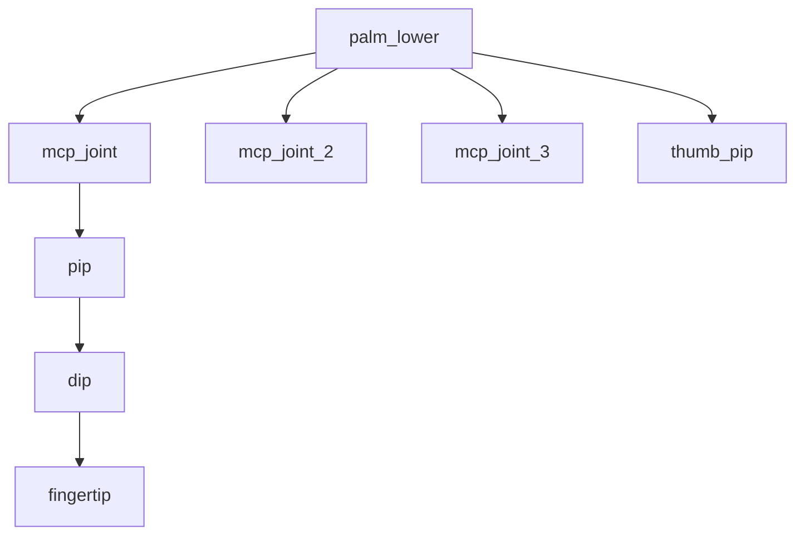

# How Robots Are Represented in Software

*A field guide grounded in this repo's IsaacGym + LEAP Hand setup.*

This guide unpacks how a robot gets from a `.urdf` file on disk to a `(num_envs, num_dofs)` action tensor the policy can drive. It's written for someone who can read Python and PyTorch but has never had to debug "the cube spawned inside the palm" or "the thumb joint is bending the wrong direction." Every concept is grounded in concrete code paths from the LEAP Hand setup at [src/LEAP_Hand_Sim/](../src/LEAP_Hand_Sim/).

**How to read this:**
- Part 0 is a vocabulary reset. Skip it if you speak rigid-body fluently; come back if something later sounds off.
- Parts I and II are foundations. Read them in order.
- Parts III through VII can be read independently after II.
- Part VIII is reference material.

**Status:** Parts 0–VI and Part VIII appendices are full first-draft. Part VII is the consolidated conventions/pitfalls checklist (settled material; not expandable).

---

## Part 0 — Background

### Rigid bodies

A rigid body is an idealized chunk of matter that doesn't deform: distances between any two points on it stay constant regardless of applied forces. Real fingers flex slightly under load; rigid-body simulations pretend they don't. This assumption is foundational — without it every robot would need a finite-element mesh and you couldn't simulate fast enough to train an RL policy on 8192 envs in parallel.

A rigid body's *state* decomposes into:

| What | Numbers | Notes |
|---|---|---|
| Position | 3 | xyz translation in some frame |
| Orientation | 3 or 4 | rpy (3) or quaternion (4) — same mathematical thing, different storage |
| Linear velocity | 3 | ẋ ẏ ż |
| Angular velocity | 3 | ω around each axis, rad/s |

That's 12 dimensions of *motion* but 13 *numbers* when orientation is stored as a quaternion — the quaternion uses 4 numbers to encode 3 rotational DoFs (the fourth is constrained: `x² + y² + z² + w² = 1`). The "13 floats per actor root state" you'll see all over IsaacGym code is this layout, exactly.

### Frames

A *frame* is a coordinate system rigidly attached to a body. Three things together:

1. An origin point (the body's anchor)
2. Three mutually perpendicular axes (X, Y, Z) sticking out of that anchor
3. The body itself — when the body moves, the frame moves with it

Frames are mathematical fiction; you can't see them. But every measurement involving the body — "the fingertip is 2 cm along the body's local X axis" — uses a frame implicitly.

The world has a frame too: the **world frame**. Conventionally fixed in space; everything else's pose is expressed relative to it.

### "Expressed in" — coordinates are frame-relative

When you write a position like `(1, 0, 0)`, that triplet is meaningless without saying *which frame*. In the world frame, `(1, 0, 0)` is one meter along world X. In the palm's frame, `(1, 0, 0)` is one meter along the palm's local X — which could point anywhere in world coordinates depending on how the palm is currently oriented.

Notation throughout this guide: `T_world_palm` means "the pose of the palm expressed in the world frame" — equivalently, the transform that takes points written in the palm frame and re-expresses them in the world frame. Underscore-separated; left frame is the "from" / "in which expressed" frame.

### Transforms and composition

A *transform* is a translation + a rotation packaged together: 7 numbers if you use `(pos3, quat4)`, or a 4×4 homogeneous matrix if you prefer. A transform takes coordinates in one frame and gives you the same physical point's coordinates in another frame:

```
T_world_palm ⊗ point_in_palm = point_in_world
```

Transforms compose. If you know `T_world_palm` and `T_palm_finger`, then:

```
T_world_finger = T_world_palm ⊗ T_palm_finger
```

If you store transforms as 4×4 matrices, `⊗` is matrix multiplication. If you store them as `(pos, quat)`, it's `(p1 + R(q1) · p2, q1 · q2)`. Either way, composition is the engine of forward kinematics in Part II.

### What this guide doesn't derive

- Quaternion math — visual intro at [eater.net/quaternions](https://eater.net/quaternions), worth the 30 minutes
- Why SO(3) is a manifold and why Euler angles can't smoothly parameterize it
- The full theory of homogeneous coordinates
- Rotation matrix derivations

Pointers live in the Further Reading appendix.

---

## Part I — Foundations: Frames, Origins, and Rotations

### 1.1 The keystone: "origin" means two different things

If you take one concept from this guide, take this one.

**Origin in the math sense:** the point `(0, 0, 0)` of a coordinate system. Every frame has one. *In its own coordinates*, the origin is trivially zero. The world frame's origin is `(0,0,0)` of the world. The palm frame's origin is `(0,0,0)` of the palm. Always. Tautologically.

**The XML tag `<origin xyz="..." rpy="..."/>`** in URDF — this is *different*. It does not mean "the origin of this frame" (which would be a tautology). It means:

> **The origin of [the thing this tag is inside]'s frame, expressed in the coordinates of the *containing* frame.**

Concretely:

- An `<origin>` inside a `<joint>` answers: *"where is the child link's frame origin, measured from the parent link's frame?"*
- An `<origin>` inside a `<visual>` answers: *"where is the mesh's anchor point, measured from the link's frame?"*
- An `<origin>` inside an `<inertial>` answers: *"where is the center of mass, measured from the link's frame?"*

In each case the answer is a *transform*: `xyz` for translation and `rpy` for rotation.

> **Pitfall.** Every `<origin>` tag answers the question *"relative to what frame?"*. The answer is always the **containing frame in the XML nesting**. Get this wrong and every URDF you read will be a fog.

A worked example. A pendulum hanging 1 m above the world origin, with a 0.5 m rod whose top end is the pivot:

```xml
<robot name="pendulum">
  <link name="world"/>

  <link name="arm">
    <visual>
      <origin xyz="0 0 -0.25" rpy="0 0 0"/>
      <geometry><cylinder length="0.5" radius="0.02"/></geometry>
    </visual>
  </link>

  <joint name="pivot" type="revolute">
    <parent link="world"/>
    <child  link="arm"/>
    <origin xyz="0 0 1" rpy="0 0 0"/>
    <axis xyz="0 1 0"/>
    <limit lower="-3.14" upper="3.14" effort="10" velocity="5"/>
  </joint>
</robot>
```

Two `<origin>` tags. They look similar; they mean different things:

- **Joint `<origin xyz="0 0 1"/>`** — "the `arm` link's frame is placed at `(0, 0, 1)` in the world frame." Containing frame: world. Thing being placed: child link.
- **Visual `<origin xyz="0 0 -0.25"/>`** — "the cylinder mesh is drawn at `(0, 0, -0.25)` in the `arm` link's frame." Containing frame: `arm`. Thing being placed: the mesh.

The visual origin is *not* in world coordinates. The `arm` frame is already at world `(0,0,1)` thanks to the joint origin. Adding `(0,0,-0.25)` inside the arm frame puts the cylinder's center at world `(0, 0, 0.75)` — its top end at the pivot, its bottom at world `(0, 0, 0.25)`. The pendulum hangs.

Misread the visual origin as being in world coordinates and copy the joint origin's `(0,0,1)` into it: the mesh ends up at world `(0,0,2)`, floating above the pivot. This is the single most common URDF reading bug, and it's caused by exactly this overload of the word "origin."

### 1.2 Three orientation representations, three audiences

Orientation in 3D is *one mathematical thing* (an element of the rotation group SO(3)). It shows up in your code in three different formats because three different audiences want three different things from it.

| Representation | Numbers | Used in | Why this audience |
|---|---|---|---|
| Roll-pitch-yaw (rpy) | 3, radians | URDF | Human-readable. `rpy="0 0 1.5708"` clearly means "90° around Z." |
| Quaternion | 4, unit-norm | Simulator state tensors (IsaacGym, MuJoCo, PhysX) | Compact, numerically stable, no gimbal lock, cheap to interpolate. |
| Rotation matrix | 9, orthogonal | Internal libraries doing composition | A rotation matrix times a vector is just a matmul. |

All three encode the same 3 rotational DoFs. The quaternion uses an extra "redundant" number with a unit-length constraint — that's why the quaternion has 4 numbers for 3 DoFs. The rotation matrix uses 9 numbers for 3 DoFs, with 6 constraints (orthogonality).

A few practical notes the rest of the guide depends on:

**Quaternion component order is a footgun.** Two conventions coexist:
- IsaacGym uses `(x, y, z, w)` — scalar last
- scipy's `Rotation`, ROS, and many older codebases use `(w, x, y, z)` — scalar first

Mix these up and your "90° rotation" comes out as "60° around a random axis." Always check the library's documentation when you cross a boundary.

**rpy in URDF is fixed-axis, applied X-Y-Z.** Some tools use intrinsic (axes rotate with each step); URDF spec is extrinsic (axes don't move). Mostly invisible if all your rpy is `0 0 0` or single-axis; bites when you have nonzero rpy on two axes.

**Gimbal lock** (rpy only): at certain configurations, two of the three Euler axes align and you lose a DoF of rotational freedom in the parameterization. Doesn't affect quaternions or matrices. Tolerable in URDF because URDFs are static specifications; problematic if you ever try to integrate rpy directly over time. The guide will mention which observations use rpy and discuss whether gimbal lock matters there.

A converter you'll want: `scipy.spatial.transform.Rotation.from_euler('xyz', [r,p,y]).as_quat()` returns the scipy `(x,y,z,w)` order, conveniently matching IsaacGym. The reverse exists.

**Storage vs DoFs:** orientation has 3 DoFs but 4 numbers in quaternion form. Pose (position + orientation) has 6 DoFs but 7 numbers. Angular velocity has 3 DoFs and 3 numbers (no inflation — it's a vector, not an orientation). When you slice the 13-float root state tensor, the layout is `pos3 + quat4 + lin_vel3 + ang_vel3` = 13 numbers for 12 motion DoFs.

### 1.3 Coordinate conventions

Locking in conventions so the rest of the guide doesn't have to keep clarifying:

- **World frame:** Z-up, right-handed. Curl your right hand's fingers from +X to +Y; your thumb points +Z.
- **Units:** meters (length), radians (angle), kilograms (mass), seconds (time), newtons (force), newton-meters (torque). The repo is consistent on this.
- **Gravity:** `(0, 0, -9.81)` by default — straight down in Z.

Right-handed is worth a deliberate moment: if you ever load a URDF authored with a left-handed convention (rare but happens in some game engine exports), every signed angle and every cross product will be backwards. Symptoms include fingers curling the wrong direction even after you've sanity-checked the `<axis>` signs.

---

## Part II — The Kinematic Tree

### 2.1 Links are nodes, joints are edges

A robot in URDF is a **kinematic tree**. The nodes of the tree are **links** (the rigid bodies — palm, fingers, phalanges). The edges of the tree are **joints** (the constraints that say "this link is connected to that link with this kind of motion allowed between them").



(Simplified — the full LEAP tree has 4 fingers × 4–5 links each plus the palm.)

A few invariants:

- A tree with N links connected by N-1 joints. (Tree theorem.)
- One link has no incoming joint: the **root link**. For LEAP, `palm_lower`. For the cube URDF, `object`. The root link's pose in the world is what you mean when you say "where the robot is."
- Joints have *no mass and no geometry*. They are pure relationships: a constraint plus a transform.

This is the inversion to internalize: when you intuitively say "the robot is made of joints," in URDF the **links** are the *things* with substance and the **joints** are the *relationships*. The number of joints (or, more precisely, the number of *movable* joints) tells you how many DoFs you have; the number of links tells you how many rigid bodies there are.

Some joints are `type="fixed"` — they're welds, contributing 0 DoFs but still showing up as joints in the URDF and as link boundaries in the tree. The LEAP hand has 16 movable revolute joints and a handful of fixed joints (cosmetic sub-meshes, mounting points).

### 2.2 Toy A — 2-link pendulum

A full URDF for the smallest interesting robot. Refer back to this whenever a concept needs grounding.

```xml
<robot name="pendulum">
  <link name="world"/>

  <link name="arm">
    <visual>
      <origin xyz="0 0 -0.25" rpy="0 0 0"/>
      <geometry><cylinder length="0.5" radius="0.02"/></geometry>
    </visual>
    <inertial>
      <origin xyz="0 0 -0.25" rpy="0 0 0"/>
      <mass value="0.1"/>
      <inertia ixx="0.00211" ixy="0" ixz="0" iyy="0.00211" iyz="0" izz="0.0000200"/>
    </inertial>
  </link>

  <joint name="pivot" type="revolute">
    <parent link="world"/>
    <child  link="arm"/>
    <origin xyz="0 0 1" rpy="0 0 0"/>
    <axis xyz="0 1 0"/>
    <limit lower="-3.14" upper="3.14" effort="10" velocity="5"/>
  </joint>
</robot>
```

Side view (X right, Z up, Y into the page):

```
   Z ↑
     │       world frame at (0, 0, 0)
     │
   1 ┤━━━━━━━ pivot ━━━━━━━   ← arm's frame is placed here (joint <origin>)
     │       │
     │       │   ← cylinder mesh, drawn from (0,0,-0.25) in arm's frame
     │       │       i.e. world (0, 0, 0.75) downward
     │       │
 0.25┤       ●
     │
     └───────┴────────── → X
             0
```

Things this minimal example pins down:

1. The **link `arm` has a frame**. There's no `<frame>` tag — it's implicit. The frame sits wherever the joint puts it (here: world `(0, 0, 1)`).
2. The **joint `<origin>` places the child link's frame in the parent's coordinates**. Read it as "child goes here, in parent's coords."
3. The **visual `<origin>` is in the link's own frame**, not the parent's, not the world's. So `xyz="0 0 -0.25"` pushes the mesh down by 0.25 m *in the arm's coordinates*. The arm is already at world `(0,0,1)`; the mesh ends up centered at world `(0,0,0.75)`.
4. The **`<axis xyz="0 1 0"/>`** says the joint rotates around the arm's local Y axis. Since rpy is all zero, the arm's local Y aligns with the world's Y. The pendulum swings in the world's X-Z plane. We'll unpack `<axis>` more in §2.5.
5. The **inertial `<origin>`** is the center of mass in the link's frame. Setting it to `(0,0,-0.25)` puts COM at the middle of the rod (since the rod runs from the link frame at 0 down to z=-0.5 in link-coords). Physically correct for a uniform rod.

### 2.3 The three (actually four) `<origin>`s in a URDF

Reading any real URDF you'll encounter `<origin>` tags in at least three places, each meaning a different transform:

1. **Joint `<origin>`** — parent link's frame → child link's frame. The *structural* offset. This is what builds the tree's geometry.
2. **Visual `<origin>`** — link's frame → mesh draw position. Pure cosmetics.
3. **Collision/inertial `<origin>`** — link's frame → collision shape (or center of mass). Functional but local.

And the secret fourth:

4. **The mesh file's own internal origin** — baked into the STL/OBJ/DAE file by whoever exported it from CAD. Not visible from the URDF. Bites when you "tweak the visual origin and the mesh moves by twice as much" — because the URDF's visual origin transforms a frame that is *already offset* by the mesh's own internal frame.

Most of these offsets get filled in automatically by CAD exporters (Onshape, SolidWorks). The mesh file's internal origin is essentially "wherever the CAD modeler placed the part on its workplane," and exporters don't usually let you control it precisely. The fix when you hit a "mesh moved twice" bug: open the mesh in MeshLab or Blender, find where its internal origin sits, and either re-export with the origin you want or compensate in the URDF's `<visual><origin>`.

> **Pitfall.** Four offsets between the link frame and any triangle in the rendered mesh: joint origin, visual origin, mesh file internal origin, and (in some workflows) a uniform scale factor on the geometry. When something is in the wrong place, walk all four.

### 2.4 Joint types

URDF defines six joint types. Practically three matter; one has an asterisk; two are rare.

| Type | DoFs | What it allows | In LEAP? |
|---|---|---|---|
| `revolute` | 1 | Rotation around an axis, with `<limit>` | Yes — all 16 movable joints |
| `prismatic` | 1 | Translation along an axis, with `<limit>` | No |
| `continuous` | 1 | Like revolute, no limits | No |
| `fixed` | 0 | Rigid weld between two links | Yes — for sub-mesh mounting |
| `floating` | 6 | Full 6-DoF relative pose (theoretical) | **See sidebar** |
| `planar` | 3 | 2D translation + 1 rotation in a plane | No (rare) |

Pretty much every URDF you'll read uses revolute, fixed, and occasionally prismatic. Continuous is for wheels. Planar is rare.

> **Sidebar — How does the cube fly around with no joints?**
>
> Look at [`assets/cube.urdf`](../src/LEAP_Hand_Sim/assets/cube.urdf): it has one link, no joints. Yet in the running sim, the cube has full 6-DoF freedom — it falls, tumbles, gets pushed by the hand. Where does that 6-DoF freedom live?
>
> **Not in the URDF.** Most simulators (IsaacGym included) don't honor `<joint type="floating">`. Instead, they give *every root link* a free 6-DoF pose by default, stored in the actor's *root state* rather than as URDF joints. Whether that root state is integrated by the physics engine (free) or pinned in place (fixed) is a per-actor setting in Python:
>
> ```python
> # src/LEAP_Hand_Sim/leapsim/utils/env_setup.py:27
> hand_opts.fix_base_link = True   # hand is bolted to the world
> # The cube actor leaves fix_base_link as False → free root.
> ```
>
> So the cube has 0 *URDF DoFs* but 13 floats of root state (pos3 + quat4 + linvel3 + angvel3) that the simulator integrates each step. We'll revisit this in Part IV when we look at state tensors.

### 2.5 `<axis>` is the axis *of rotation*, not the direction of motion

This is the #1 trap when reading joint tags, and it's worth its own section.

For a `<joint type="revolute">`, the `<axis>` specifies the axis the child rotates *around*. Things lying *on* the axis don't move. Things *perpendicular* to the axis swing in circles.

So if you read `<axis xyz="0 0 1"/>` and think "the joint moves things up and down along Z" — **wrong**. It means the joint rotates things *around* Z; perpendicular points swing in the X-Y plane.

A second subtlety: **`<axis>` is expressed in the child link's local frame**. Not the world frame. Not the parent's frame. The child's. *After* the joint's `<origin rpy>` has rotated the child's frame.

That's why URDFs exported from CAD look numerically chaotic. From [`leap_hand/robot.urdf`](../src/LEAP_Hand_Sim/assets/leap_hand/robot.urdf), the first finger MCP joint:

```xml
<joint name="..." type="revolute">
  <origin xyz="-0.007 0.023 -0.019"
          rpy="1.5707963 1.5707963 0" />
  <parent link="palm_lower" />
  <child  link="mcp_joint" />
  <axis xyz="0 0 -1"/>
  <limit effort="0.95" velocity="8.48" lower="-0.314" upper="2.23"/>
</joint>
```

The `<origin rpy="1.5708 1.5708 0"/>` rotates the `mcp_joint` frame by 90° around X then 90° around Y, *before* the axis applies. After that rotation, the child's local Z points in whatever world-frame direction the finger should flex around. So `<axis xyz="0 0 -1"/>` in that rotated frame corresponds to a perfectly sensible "knuckle flexion" axis in world coordinates, even though the literal triple `(0, 0, -1)` looks like nothing in particular.

> **Pitfall.** When debugging "the finger curls the wrong way," check three things in order:
> 1. The sign of `<axis>` (a flipped sign flips the direction of positive rotation)
> 2. The `<origin rpy>` of the joint (rotates the frame the axis lives in)
> 3. The mesh file's internal orientation (if the mesh itself was exported sideways)
>
> The fix is rarely "change the axis." Usually it's a sign flip or fixing the joint origin's rpy.

### 2.6 DoF accounting

The total number of DoFs in a robot is `sum(joint.dof_count for joint in joints)`. For LEAP: 16 revolutes × 1 DoF each + a handful of fixed joints × 0 = **16 DoFs**.

The **configuration vector** `q` is the 16-vector of joint angles, in radians. (For a prismatic joint, the corresponding element would be in meters — DoF units depend on joint type.) The configuration *completely specifies the geometry* of the robot given the root pose: every link's world position and orientation is determined by `(root_pose, q)`.

Important separations:

- **DoF count** = how many independent scalars define configuration. Doesn't depend on control mode.
- **Control mode** (position/velocity/torque) = what the policy's numbers *mean*. Same DoF, different command formats.
- **State** = `(q, q̇)` per DoF, so 2× the DoF count of numbers if you include velocities. For LEAP, joint state is `(16, 2) = 32` numbers per env.
- **Root state** is separate — 13 numbers for the actor's root pose+velocity, regardless of DoF count.

> **Pitfall.** The action tensor's width is *not always* the DoF count. For LEAP it is (16 actions = 16 DoFs because position control per DoF). For some setups it differs — e.g., a hand with mimic joints (one motor driving multiple joints) might have fewer actions than DoFs, or a hierarchical policy might output a smaller "skill" action that gets expanded into per-joint targets downstream.

### 2.7 Toy B — 3-link planar arm and forward kinematics

Two joints, three links, all in a plane. The minimum needed to see why downstream poses depend on upstream angles.

```
Setup: base at world (0,0,0). Both joints revolute around their child's local Z.
       Shoulder→elbow link is 1 m long (joint <origin xyz="1 0 0"/>).
       Elbow→hand link is 1 m long (joint <origin xyz="1 0 0"/>).

θ₁ = 90°, θ₂ = 0°
```

Step through the FK by composing transforms:

```
T_world_base       = identity
T_world_shoulder   = T_world_base ⊗ T_base_shoulder
                   = identity ⊗ R_z(θ₁=90°)
                   ≈ "rotate frame 90° around Z; origin stays at (0,0,0)"

T_world_elbow      = T_world_shoulder ⊗ T_shoulder_elbow ⊗ R_z(θ₂=0)
                   = (rotated 90° about Z) ⊗ (translate (1,0,0) in shoulder coords) ⊗ identity
```

In the shoulder's rotated frame, "1 m along local X" points along world's *positive Y* (because we rotated 90° about Z). So the elbow link's frame origin in the world ends up at **(0, 1, 0)**, not (1, 0, 0).

The hand (third link) would be 1 m further along the elbow's local X, which — since the elbow's frame inherits the shoulder's 90° rotation and adds no rotation of its own (θ₂=0) — points again along world +Y. So the hand link sits at world (0, 2, 0).

> **The conceptual punchline.** Every joint angle along the chain moves *every link downstream of it*. The elbow's world pose depends on θ₁ (because the elbow's `<origin>` is expressed in the shoulder's frame, which θ₁ rotates) AND on θ₂ if you care about anything attached to the elbow link beyond its origin. A LEAP fingertip is 4 links deep; its world pose depends on the hand's root pose plus all 4 joint angles up the chain.

### 2.8 FK in practice: you don't compute it, the sim does

The math in §2.7 is the right mental model, but you rarely write transform composition code yourself. The physics engine has already computed every link's pose (it had to, in order to do collision detection and integrate forces). IsaacGym exposes the result as a **rigid body state tensor**:

```python
# tasks/leap_hand_rot.py:87-95
rigid_body_tensor       = self.gym.acquire_rigid_body_state_tensor(self.sim)
...
self.rigid_body_states  = gymtorch.wrap_tensor(rigid_body_tensor).view(self.num_envs, -1, 13)
self.num_bodies         = self.rigid_body_states.shape[1]
```

Shape `(num_envs, num_bodies, 13)`. One 13-float row per link, in every env. To get the world position of the fingertip in env 42:

```python
self.gym.refresh_rigid_body_state_tensor(self.sim)
fingertip_pos = self.rigid_body_states[42, FINGERTIP_BODY_IDX, 0:3]
```

You never multiplied a transform. The engine did it for you, every step, in parallel across all 8192 envs, on GPU.

When you *do* need to compute FK yourself:
- On a real robot, reading joint encoders, with no simulator to do it for you
- When debugging "the fingertip should be here but it's there" — reasoning about the chain transforms is the diagnosis
- When retargeting motion from one robot's joint angles to another's

For (1), libraries like `pinocchio`, `KDL`, and `roboticstoolbox-python` will compute FK from a URDF. For (2) and (3), you mostly reason about it without writing the code.

**Brief note on Inverse Kinematics (IK).** The inverse problem: "given a desired fingertip pose, what joint angles produce it?" IK is harder than FK because it can be ill-posed (multiple solutions, or no solution). It's used for teleoperation, motion planning, and motion retargeting. This codebase does *not* use IK — the policy outputs joint targets directly, so the network learns the inverse mapping implicitly. If you ever wire teleoperation in, you'll need an IK solver; for in-sim RL training, you don't.

---

## Part III — Geometry and Inertia

Every `<link>` in a URDF carries up to three independent geometric definitions, each serving a different consumer in the simulator:

```xml
<link name="palm_lower">
  <visual>    <!-- what the renderer draws  -->   ...high-poly OK
  <collision> <!-- what physics uses for contact --> ...low-poly preferred
  <inertial>  <!-- what physics uses to integrate --> mass, COM, inertia tensor
</link>
```

A *fourth* property set — material properties like friction and restitution — is conspicuously **not** in the URDF. Those live in the simulator's Python API. This split (geometry in URDF, materials in code) is one of the more confusing aspects of the URDF model and worth knowing up front.

### 3.1 The three geometries and why they're separate

The split exists because the three consumers have radically different cost structures.

**Visual** is for the rendering pipeline. The GPU happily renders 500K-triangle meshes; you barely notice. Textures, colors, UVs all live in `<visual>`. *Physics does not read this tag.* You can put your most detailed mesh here without consequence — except memory and download size.

**Collision** is for contact detection, which is one of the most expensive parts of a rigid-body simulation. Every pair of potentially-touching bodies needs collision queries, often multiple times per physics substep. With 8192 envs × a hand against a cube × multiple substeps × hundreds of body-pairs, that adds up. *High-poly meshes here will either tank your sim speed or produce unstable contacts* (jitter, exploding forces, penetration). The norm: simplified shapes.

**Inertial** doesn't define a *shape* — it defines three numbers (well, ten): mass, center-of-mass position, and the six unique components of the inertia tensor. The physics engine needs these to integrate Newton's laws (`F = ma`) and Euler's rotational equation (`τ = Iα`) for each rigid body.

The three are independent in another sense: the simulator reads each into a different data structure and you can override them after loading.

### 3.2 Visual geometry: cosmetics

This is the cheapest section of the URDF to read because almost nothing about it changes physics. Visual `<geometry>` can be a primitive (`<box>`, `<sphere>`, `<cylinder>`, `<capsule>`) or a mesh (`<mesh filename="..."/>`). The LEAP hand uses STL meshes throughout, each with their own `<origin>` to position the mesh inside the link's frame:

```xml
<!-- assets/leap_hand/robot.urdf:3-11 -->
<visual>
  <origin xyz="-0.020 0.026 -0.035" rpy="0 0 0" />
  <geometry><mesh filename="palm_lower.stl"/></geometry>
  <material name="palm_lower_material">
    <color rgba="0.60 0.15 0.15 1.0"/>
  </material>
</visual>
```

The `<origin>` here is the second of our three (four) offsets from §2.3. The `<material>` block carries rendering color — `rgba` in 0–1 range. Materials can also reference textures via `<texture filename="..."/>`. None of this affects physics, contact, or training.

**You'll rarely modify visual geometry**, except to change colors for debugging ("paint the thumb red so I can spot it in renders").

### 3.3 Collision geometry: where physics actually pays attention

Three ways to define a collision shape, in order of increasing cost and fidelity:

1. **Primitives** (`<box>`, `<sphere>`, `<cylinder>`, `<capsule>`). Constant-time collision queries; extremely stable. The cube object uses this: `<box size="0.075 0.075 0.075"/>` ([cube.urdf:7](../src/LEAP_Hand_Sim/assets/cube.urdf#L7)).
2. **Convex hulls** of a mesh. Linear in vertex count; still very fast. You get the *outline* of the mesh without its interior detail.
3. **Triangle meshes** (`<mesh>` directly). General but slow. Modern engines often refuse non-convex meshes outright, or run a *convex decomposition* preprocess to split them into multiple convex pieces.

The LEAP URDF *appears* to use the same STL for both visual and collision:

```xml
<!-- assets/leap_hand/robot.urdf:12-17 -->
<collision>
  <origin xyz="-0.020 0.026 -0.035" rpy="0 0 0" />
  <geometry><mesh filename="palm_lower.stl"/></geometry>
</collision>
```

But the loader's asset options reveal what actually happens:

```python
# src/LEAP_Hand_Sim/leapsim/utils/env_setup.py:32-33
hand_opts.vhacd_enabled            = True
hand_opts.vhacd_params.resolution  = 300000
```

**V-HACD** (Volumetric Hierarchical Approximate Convex Decomposition) is the standard tool for turning a non-convex mesh into a set of convex pieces approximating it. The 300000 is a voxel resolution — higher means a more faithful decomposition with more pieces. With `vhacd_enabled = True`, IsaacGym preprocesses the LEAP STL meshes into convex hulls at load time. Visually the URDF says "use the mesh," but physically the engine sees "a collection of convex pieces approximating the mesh."

This is why "LEAP uses the STL for collision" isn't quite the whole story. The STL is the *input*; the convex decomposition is what physics actually queries.

Two related asset options worth knowing:

```python
hand_opts.collapse_fixed_joints = True  # fuse fixed-jointed links into one rigid body
hand_opts.thickness             = 0.001 # collision margin (1mm) added to all shapes
```

`collapse_fixed_joints` is a quiet optimization: any links connected by `<joint type="fixed">` are merged into a single rigid body at load time. The URDF might say there are 21 links, but with fixed-joint collapsing the sim might see only 16 or 17. This is why `num_bodies` from `acquire_rigid_body_state_tensor` can be smaller than the URDF link count — the *bodies* the sim simulates aren't always 1:1 with URDF links.

`thickness` adds a small inflation margin to every collision shape. It makes contact more stable (small interpenetrations get pushed out before they become numerical problems) at the cost of objects appearing to never quite touch. 1mm is a sane default; bigger numbers create visible gaps.

**Failure modes you'll meet:**

| Symptom | Likely cause |
|---|---|
| Cube falls through palm | Collision shape too coarse — visual mesh is right but V-HACD produced a hollow approximation, or the URDF only had a primitive `<box>` that doesn't include the fingers |
| Cube wobbles or jitters violently on contact | Sharp collision corners + stiff PD; thickness too small; substep count too low |
| Cube penetrates fingers visibly | thickness ≈ 0 + high contact forces; or one body uses primitives and the other uses convex hulls and they disagree on contact normals |
| Sim load is suddenly very slow | V-HACD running on a complex new mesh — happens once at startup; resolution=300000 is heavy |

### 3.4 The fourth offset: the mesh file's own internal origin

§2.3 promised four offsets between the link frame and a rendered triangle. Three are visible in the URDF; the fourth is invisible.

When a CAD tool (Onshape, SolidWorks, Fusion) exports a mesh, the mesh's vertices are written in *some* coordinate system. Usually it's whatever workplane the CAD modeler started on. The mesh file's `(0, 0, 0)` is wherever the CAD origin was. Different parts of the same robot might have been modeled on different workplanes, so each `.stl` has its own internal origin that bears no necessary relationship to the link's frame.

The chain of offsets when you draw a single triangle:

```
world frame
  ⊗ (chain of joint <origin>s and joint angles, §2.7)         → link frame
  ⊗ <visual><origin>                                          → mesh's intended position
  ⊗ (implicit: mesh file's own internal origin)               → triangle position
```

Three of those offsets are explicit in the URDF. The fourth — the mesh's internal origin — is opaque.

**This is why "I changed `<visual><origin>` and the mesh moved by twice as much" happens.** When you imagine moving the mesh, you're imagining moving its visual `<origin>`. But the mesh has its own internal origin that's already non-zero, and changing the visual origin shifts the *composition* of the two, not the visible mesh location.

The fix: open the mesh in Blender or MeshLab, find where its internal origin sits relative to the visible geometry, and either:

1. Re-export with the origin centered where you want it (best), or
2. Compensate by adding a counter-offset in `<visual><origin>` (hacky but works)

This problem is most acute when you're swapping in a new mesh from a different source — your old mesh might have had an origin at the centroid; the new one might have it at a corner. Symptoms are subtle: visuals look "almost right but off."

### 3.5 Inertial properties

The `<inertial>` block defines the dynamic *behavior* of a rigid body — how it accelerates under force, how it tumbles under torque. Three pieces:

```xml
<inertial>
  <origin xyz="0 0 -0.25" rpy="0 0 0"/>   <!-- center of mass in link frame -->
  <mass value="0.1"/>                      <!-- kilograms -->
  <inertia ixx="0.00211" ixy="0" ixz="0"
           iyy="0.00211" iyz="0" izz="0.0000200"/>
</inertial>
```

#### Mass

Scalar, in kilograms. Drives `F = ma`. Zero mass is invalid — most physics engines either error out at load time or silently clamp to a minimum (often `1e-9`). URDFs auto-exported from CAD sometimes contain links with `mass="0"` for cosmetic sub-meshes; if your sim refuses to load, this is one of the first places to check.

#### Center of mass (COM)

The `<inertial><origin>` specifies the center of mass *in the link's frame*. For symmetric bodies (a uniform cube, a uniform rod), the COM sits at the geometric centroid. For asymmetric bodies (an L-bracket, a phalanx with a battery on one side), the COM can be anywhere — and getting it wrong shifts the apparent "balance" of the body when external forces are applied.

The `rpy` part of the inertial origin is the *orientation* of the body's principal-axis frame relative to the link's frame. We'll come back to this in a moment.

#### Inertia tensor

A 3×3 symmetric matrix that describes how mass is distributed around the COM. Six unique numbers, written as:

```
I = ⎡ ixx  ixy  ixz ⎤
    ⎢ ixy  iyy  iyz ⎥
    ⎣ ixz  iyz  izz ⎦
```

Symmetric, so `ixy = iyx` and you only write the upper triangle in URDF.

**Physical meaning:** the inertia tensor governs rotational dynamics. Newton's law for rotation:

```
τ = I α
```

Where `τ` is the applied torque (3-vector), `α` is the resulting angular acceleration (3-vector), and `I` is the inertia tensor. **Bigger inertia → smaller angular acceleration for a given torque** (the body is "rotationally heavy"). A spinning ice skater pulls in their arms to *decrease* their inertia, which *increases* their spin rate for the same angular momentum.

**Diagonal terms (`ixx`, `iyy`, `izz`)** are *moments of inertia* — how hard it is to spin the body around the X, Y, Z axes of the link frame, respectively. A long thin rod has tiny `ixx` (around the long axis: easy to spin) and large `iyy`, `izz` (perpendicular: hard to spin).

**Off-diagonal terms (`ixy`, `ixz`, `iyz`)** are *products of inertia*. They're zero when the body's *principal axes of inertia* (the natural rotation axes determined by its mass distribution) align with the link's coordinate axes. They're nonzero when those axes are tilted with respect to each other.

For a uniform cube whose faces are aligned with X/Y/Z, the principal axes coincide with the coordinate axes — off-diagonals are 0, and all three diagonals are equal. For an L-shaped bracket, the principal axes tilt at some angle to any "natural" frame — off-diagonals are nonzero.

> **A note on equal diagonals.** "All three diagonals equal" means the body has a *spherically symmetric* mass distribution — it looks the same from every direction, rotationally. True spheres and perfect cubes both satisfy this. Most other shapes don't: a finger phalanx has very different `ixx` than `izz` because it's elongated along one axis.

#### Sanity-checking inertials

Most URDFs in the wild have approximate inertials. Where they come from:

1. **CAD auto-compute.** SolidWorks or Onshape integrates over the geometry given an assumed uniform density. Accurate *if* the density assumption matches the real part — often it doesn't (the CAD model might be hollow plastic but the auto-compute assumes solid aluminum).
2. **Hand-authored.** The URDF author plugged in plausible numbers. `0.0001` is a popular round number for "small but nonzero."
3. **Empirical measurement.** Trifilar pendulum, bifilar pendulum, or just very careful spinning. Rare; usually done only for hardware where inertial precision matters.

Sims are forgiving for *contact-dominated* tasks because contact forces dominate inertia errors at the scale of fingertip manipulation. For *free-flight* tasks (drones, projectiles, free-floating space robots), inertial precision matters much more.

**Useful sanity-check formulas:**

| Shape | Mass | Geometry | Diagonal inertia |
|---|---|---|---|
| Uniform solid cube | m | side s | `I_diag = m · s² / 6` |
| Uniform solid sphere | m | radius r | `I_diag = (2/5) · m · r²` |
| Uniform solid cylinder | m | radius r, length L | `I_axis = m·r²/2`, `I_perp = m·(3r² + L²)/12` |
| Uniform solid rod | m | length L (thin) | `I_axis ≈ 0`, `I_perp = m·L²/12` |

#### LEAP cube worked example

From [cube.urdf:18-21](../src/LEAP_Hand_Sim/assets/cube.urdf#L18-L21):

```xml
<inertial>
  <mass value="0.05" />
  <inertia ixx="0.0001" ixy="0.0" ixz="0.0"
           iyy="0.0001" iyz="0.0" izz="0.0001"/>
</inertial>
```

The cube is `0.075 m` per side ([cube.urdf:7](../src/LEAP_Hand_Sim/assets/cube.urdf#L7)). Plug in:

```
I_diag = 0.05 × 0.075² / 6
       = 0.05 × 0.005625 / 6
       ≈ 4.69 × 10⁻⁵ kg·m²
```

The URDF says `1.00 × 10⁻⁴` — about **2.13× too high**. Not catastrophic; the cube will tumble slightly slower than a real 50 g, 7.5 cm cube would. For RL on in-hand rotation this is invisible; for precision sim-to-real of fine manipulation it might show up as small but systematic differences in spin rates.

The off-diagonals are 0 and the three diagonals are equal — both correct for a cube whose body frame is aligned with its geometric axes. The *structure* of the tensor is right; just the magnitudes are loose.

> **Pitfall.** When you swap in a new object URDF, run this sanity check. The structure of the inertia (zeros vs nonzeros, diagonals equal vs not) tells you whether the *shape* of the inertia is reasonable; the magnitudes tell you whether the *scale* is right. Many bug reports about "the policy doesn't transfer to the new object" trace back to wildly wrong inertia for the new object.

### 3.6 Material properties: NOT in the URDF

Here's a fact that surprises people coming from ROS or graphics: **friction, restitution (bounciness), rolling friction, and contact damping are not URDF tags.** They live in the simulator's per-shape properties, set in Python after the asset is loaded.

In IsaacGym, the relevant calls are `get_asset_rigid_shape_properties` and `set_asset_rigid_shape_properties` (or the actor-level variants). From LEAP's friction-randomization code:

```python
# tasks/leap_hand_rot.py:528-531  (per-actor, per-env friction randomization)
props = self.gym.get_actor_rigid_shape_properties(env_ptr, actor_handle)
for p in props:
    p.friction = rand_friction
self.gym.set_actor_rigid_shape_properties(env_ptr, actor_handle, props)
```

Properties on each rigid shape include:

| Property | Meaning | Typical range |
|---|---|---|
| `friction` | Coulomb friction coefficient between this shape and others | 0.0–2.0 |
| `restitution` | Bounciness (1.0 = perfectly elastic) | 0.0–1.0 |
| `rolling_friction` | Resistance to rolling motion | usually 0 |
| `torsion_friction` | Resistance to twisting at a contact point | usually 0 |
| `contact_offset` | Distance at which contact is registered | small positive |
| `rest_offset` | Distance at which bodies come to rest | smaller than contact_offset |
| `compliance` | Inverse stiffness of the contact | 0 for rigid |
| `filter` | Collision filter bitmask (§3.7) | bitmask |

**Why this split (geometry in URDF, materials in Python)?** The URDF was designed for ROS, originally for visualization and basic kinematics; material properties were considered simulator-specific. Different simulators handle friction differently (rigid Coulomb vs cone-of-friction vs Bullet's complementarity-based solver), so the URDF avoided opinionating. The cost is conceptual fragmentation — you can't read a URDF and know how slippery the hand is. You have to read the Python.

**LEAP-specific friction details:**

- Hand-internal *joint* friction (a different thing — friction inside the joint bearing) is set per-DoF at `leap_hand_rot.py:447`: `leap_hand_dof_props['friction'][i] = 0.01`. Small value, simulating a real bearing's slight stickiness.
- Hand-to-object *contact* friction defaults to ~1.0 (set on each rigid shape).
- Object friction is randomized per-env if `randomize_friction` is enabled (`leap_hand_rot.py:524-533`). This is one of the more impactful domain-randomization knobs for sim-to-real.

> **Pitfall.** "The cube slips out of the hand" can be a friction issue (too low), a control issue (PD gains too loose), or a geometry issue (collision shape doesn't match contact patches). Check friction *first* — it's the cheapest to change, lives in one place in the Python, and randomization-bounds are the most common debug knob.

### 3.7 Collision filtering: who collides with whom

By default, *every* rigid shape in the sim can collide with every other. Usually you don't want this — you want the hand to collide with the cube but not with itself (the fingers don't usually touch each other), and you definitely don't want the palm and the first phalanx to register a collision just because they share a joint.

IsaacGym solves this with a **per-shape filter bitmask**. Two shapes collide iff `(filter_a & filter_b) == 0` — i.e., they share no bits. (The exact rule varies by engine; this is the IsaacGym convention.) Shapes in the same "filter group" don't collide.

In the LEAP setup ([env_setup.py:39-49](../src/LEAP_Hand_Sim/leapsim/utils/env_setup.py#L39-L49)):

```python
rsp = gym.get_asset_rigid_shape_properties(hand_asset)
for i, (_, body_group) in enumerate(env_cfg["mask_body_collision"].items()):
    filter_value = 2 ** i
    for body_idx in body_group:
        start, count = body_shape_indices[body_idx]
        for idx in range(count):
            rsp[idx + start].filter = rsp[idx + start].filter | filter_value
if env_cfg["disable_self_collision"]:
    for i in range(len(rsp)):
        rsp[i].filter = 1
gym.set_asset_rigid_shape_properties(hand_asset, rsp)
```

The pattern: read the asset's shape properties, OR a group-specific bit into each shape's `filter`, write back. With `disable_self_collision = True`, every shape gets the same `filter = 1`, so no two shapes on the hand ever collide.

**Why disable self-collision at all?** Two reasons:

1. **Speed** — fewer pair-checks. With ~17 bodies on the hand, fully self-colliding adds ~136 potential pairs per env per substep. Disabling self-collision removes them.
2. **Correctness** — many CAD-exported meshes have small inter-penetrations between adjacent links at rest. Without filtering, you'd get spurious contact forces at every step from these "phantom" contacts.

The cost: the policy could in principle drive a finger *through* the palm without resistance. In practice, joint limits prevent this from happening for sensible joint ranges, so the tradeoff is usually favorable.

`mask_body_collision` lets you selectively disable collisions between *groups* of bodies — e.g., "fingers in the same finger don't collide, but fingers in different fingers do." Useful when you want to allow cross-finger contact for natural grasping but suppress within-finger noise.

### 3.8 Pitfalls checklist for Part III

1. **Cube falls through palm.** Collision shape too coarse — open the V-HACD output if you can, or temporarily switch to a `<box>` primitive to confirm whether it's a shape issue or a friction issue.
2. **Contact jitter / buzzing.** Sharp collision corners + stiff PD; or thickness too small; or substep count too low. Try increasing `thickness` to `0.002` and see if it stabilizes.
3. **Object inter-penetrates fingers visibly.** Increase `thickness`, or reduce PD `pgain`, or increase the substep count.
4. **"Almost-right but off" visual.** The mesh file's hidden internal origin (§3.4). Open the STL in MeshLab and check where `(0,0,0)` actually sits relative to the visible geometry.
5. **URDF inertia doesn't match physical intuition.** Run the sanity-check formula. For most simple shapes the analytical value is the right ballpark; URDFs of 2× to 5× error are common in the wild.
6. **Sim refuses to load with a "zero mass" error.** Some link has `<mass value="0"/>`. Either add a tiny mass (`1e-4`) or merge that link into its parent via `<joint type="fixed">` + `collapse_fixed_joints=True`.
7. **"My policy works for the cube but not the new object I added."** Three things to check, in order: friction, inertia, collision shape. Each can be wrong for the new object even if it looked right by eye.
8. **Adjacent links spuriously colliding at rest.** Use `mask_body_collision` to group them, or set `disable_self_collision = True` if you don't need self-contact at all.

---

## Part IV — The Simulator Side (IsaacGym)

By this point you can read a URDF: links, joints, frames, geometries, inertials. Now we look at what happens *after* `gym.load_asset()` returns — how those URDFs become objects in a running simulation, how their state is exposed to your Python code, and how you read and write that state without scrambling 8192 envs.

This part is the highest-leverage section of the guide for someone modifying the code. Almost every bug that isn't a URDF bug is a tensor-indexing bug.

### 4.1 The loading pipeline

A URDF on disk becomes a runtime *asset* via:

```python
asset = gym.load_asset(sim, asset_root, urdf_filename, asset_options)
```

`asset_options` is a `gymapi.AssetOptions()` struct with ~20 fields that control how the loader interprets the URDF. From LEAP's hand-load ([env_setup.py:25-36](../src/LEAP_Hand_Sim/leapsim/utils/env_setup.py#L25-L36)):

```python
hand_opts = gymapi.AssetOptions()
hand_opts.flip_visual_attachments  = False
hand_opts.fix_base_link            = True
hand_opts.collapse_fixed_joints    = True
hand_opts.disable_gravity          = False
hand_opts.thickness                = 0.001
hand_opts.angular_damping          = 0.01
hand_opts.vhacd_enabled            = True
hand_opts.vhacd_params.resolution  = 300000
hand_opts.default_dof_drive_mode   = gymapi.DOF_MODE_POS

hand_asset = gym.load_asset(sim, str(hand_path.parent), hand_path.name, hand_opts)
```

These flags are not URDF tags; they're loader directives that shape what physics sees. The most behavior-changing ones:

| Flag | Effect |
|---|---|
| `fix_base_link` | Root link is welded to the world; its root state is read-only |
| `collapse_fixed_joints` | Fixed-joint pairs are fused into single rigid bodies (faster, fewer link rows in `rigid_body_state`) |
| `disable_gravity` | Per-actor toggle. False here; the hand "experiences" gravity but doesn't fall because it's base-fixed |
| `thickness` | Adds a contact margin to every collision shape (§3.3) |
| `vhacd_enabled` | Run V-HACD convex decomposition on mesh collision shapes at load time (§3.3) |
| `default_dof_drive_mode` | Sets the actuation mode for every DoF (we'll come back to this in Part V) |
| `flip_visual_attachments` | Some CAD exports have visuals mirrored; this fixes them. For LEAP, False (URDF was correct) |

> **Pitfall.** `fix_base_link` is *not* in the URDF — there is no URDF tag that says "this robot is fixed to the world." It's a Python loader flag. If you're modifying a URDF and looking for the line that locks the base in place, you won't find it. Look at the asset options in the task setup instead.

An asset is **stateless template**. To actually run physics, you create *actors* (instances of the asset) inside *envs* (isolated simulation worlds).

### 4.2 Envs and actors

The two layered containers:

- **Env** — an isolated mini-world with its own gravity, contacts, physics state. LEAP runs 8192 envs in parallel on one GPU.
- **Actor** — one instance of an asset placed inside an env. LEAP's setup puts two actors per env: one `hand` actor (the LEAP hand asset) and one `object` actor (a cube, ball, or other manipulation target).

The creation loop, from [leap_hand_rot.py:478-537](../src/LEAP_Hand_Sim/leapsim/tasks/leap_hand_rot.py#L478-L537):

```python
for i in range(num_envs):
    env_ptr = self.gym.create_env(self.sim, lower, upper, num_per_row)

    # Hand actor
    hand_actor = self.gym.create_actor(env_ptr, self.hand_asset, hand_pose,
                                       'hand', i, -1, 0)
    self.gym.set_actor_dof_properties(env_ptr, hand_actor, leap_hand_dof_props)
    self.hand_indices.append(self.gym.get_actor_index(env_ptr, hand_actor,
                                                     gymapi.DOMAIN_SIM))

    # Object actor
    object_handle = self.gym.create_actor(env_ptr, self.object_asset_list[type_id],
                                          obj_pose, 'object', collision_group, 0, 0)
    self.object_indices.append(self.gym.get_actor_index(env_ptr, object_handle,
                                                       gymapi.DOMAIN_SIM))
```

A few things to notice:

1. **Actors are created with a *pose*** (`hand_pose`, `obj_pose`) — that's the initial root pose. After that, the actor's pose lives in the simulator's state tensors.
2. **Each actor gets a *collision group*** (the `i`, the `collision_group`). Actors in different envs are placed in different groups so an object in env 0 can't collide with the hand in env 1. (You don't see env walls; they're just collision-group separation.)
3. **The task records a per-env actor index** (`self.hand_indices[i]`, `self.object_indices[i]`) returned by `get_actor_index(..., DOMAIN_SIM)`. This is the **global, sim-flat actor index** — `0, 1, 2, ..., 2*num_envs - 1`, ordering all actors across all envs. We'll use this for indexing into root-state tensors.

The `DOMAIN_SIM` flag is important. There are three domain types for indices:

- `DOMAIN_ACTOR` — local to one actor (joint indices within that actor)
- `DOMAIN_ENV` — local to one env (actor indices within that env: 0 = hand, 1 = object for LEAP)
- `DOMAIN_SIM` — global across all envs (every actor in every env)

When you write tensors back, the sim-domain index is what IsaacGym wants. Mix up domains and you'll write the wrong actor.

### 4.3 The three-tensor view of state

The simulator maintains state in three large GPU tensors that you can read and write directly. They are *not* redundant — they slice the same physical reality from three angles.

| Tensor | Shape | One row represents | LEAP example shape |
|---|---|---|---|
| `actor_root_state` | `(N_envs × N_actors, 13)` | One actor's root pose+vel | `(16384, 13)` |
| `dof_state` | `(N_envs × N_dofs_per_env, 2)` | One DoF's (q, q̇) | `(131072, 2)` |
| `rigid_body_state` | `(N_envs, N_bodies_per_env, 13)` | One link's world pose+vel | `(8192, ~17, 13)` |

#### `actor_root_state` — the floating-base tensor

One row per actor across all envs. Each row is the 13-float layout we've been building toward:

```
[ pos_x, pos_y, pos_z,        # 3: position
  quat_x, quat_y, quat_z, quat_w,  # 4: orientation (note (x,y,z,w) order)
  lin_vel_x, lin_vel_y, lin_vel_z, # 3: linear velocity
  ang_vel_x, ang_vel_y, ang_vel_z  # 3: angular velocity
]                                  # = 13
```

For the hand (which has `fix_base_link = True`), this row is read-only from physics' perspective — it stays at the pose you placed it in. You *can* still write to it from Python, but the physics integrator won't move it.

For the cube (no fix_base_link), this row is the only motion state — there are no DoF rows for the cube. **All 6 DoFs of the cube's motion live here.** Write a new pose into this row at reset time and the cube teleports to that pose.

This is the floating-base story from §2.4 made concrete. The cube has 13 floats of state, no DoFs, and its `actor_root_state` row gets integrated by physics each step.

#### `dof_state` — the articulated tensor

One row per movable DoF across all envs. Two floats per row: position `q` and velocity `q̇`. For LEAP: 16 hand DoFs × 8192 envs = 131,072 rows.

The cube contributes zero rows here. **If an object lives only in `actor_root_state` and you accidentally try to find it in `dof_state`, you'll find nothing.** This is the most common indexing confusion.

LEAP reshapes `dof_state` into a more ergonomic per-env view ([leap_hand_rot.py:100-102](../src/LEAP_Hand_Sim/leapsim/tasks/leap_hand_rot.py#L100-L102)):

```python
self.leap_hand_dof_state = self.dof_state.view(self.num_envs, -1, 2)[:, :self.num_leap_hand_dofs]
self.leap_hand_dof_pos   = self.leap_hand_dof_state[..., 0]   # (num_envs, 16)
self.leap_hand_dof_vel   = self.leap_hand_dof_state[..., 1]   # (num_envs, 16)
```

This is a *view*, not a copy. Writing to `leap_hand_dof_pos[42, 3] = 0.5` writes through into the underlying `dof_state`, which physics reads from next step.

#### `rigid_body_state` — forward kinematics for free

One row per rigid body (link, after `collapse_fixed_joints` merging) per env. Shape `(N_envs, N_bodies, 13)` — same 13-float layout as `actor_root_state` but for every link, including non-root ones.

This is the tensor that gives you fingertip positions, palm orientation, every phalanx's world pose. The physics engine had to compute these to do contact detection; it just exposes the result.

LEAP acquires it at [leap_hand_rot.py:88, 94](../src/LEAP_Hand_Sim/leapsim/tasks/leap_hand_rot.py#L88):

```python
rigid_body_tensor       = self.gym.acquire_rigid_body_state_tensor(self.sim)
self.rigid_body_states  = gymtorch.wrap_tensor(rigid_body_tensor).view(self.num_envs, -1, 13)
self.num_bodies         = self.rigid_body_states.shape[1]
```

Notice the `view(self.num_envs, -1, 13)` reshape. The raw tensor IsaacGym hands back is flat; the `-1` lets PyTorch figure out the per-env body count.

To get the world position of body `body_idx` in env `env_id`:

```python
self.gym.refresh_rigid_body_state_tensor(self.sim)  # pull latest values
pos = self.rigid_body_states[env_id, body_idx, 0:3]
```

> **The central insight.** Floating motion lives in `actor_root_state`. Articulated joint motion lives in `dof_state`. Per-link world poses (FK results) live in `rigid_body_state`. They are not redundant; each answers a different question. Picking the wrong one is the #1 IsaacGym indexing bug.

### 4.4 The IsaacGym tensor API: acquire → wrap → refresh → set

The lifecycle of a state tensor in Python:

```python
# Once at init:
handle = self.gym.acquire_<X>_state_tensor(self.sim)   # opaque IsaacGym handle
self.X = gymtorch.wrap_tensor(handle)                   # PyTorch tensor sharing GPU memory
# (optional) reshape into something ergonomic
self.X = self.X.view(self.num_envs, -1, 13)

# Each step, before reading:
self.gym.refresh_<X>_state_tensor(self.sim)             # pull latest from physics

# To write back (and have physics see it):
self.gym.set_<X>_state_tensor(self.sim, gymtorch.unwrap_tensor(self.X))
# Or, more usefully, the indexed variant for partial updates:
self.gym.set_<X>_state_tensor_indexed(self.sim,
    gymtorch.unwrap_tensor(self.X),
    gymtorch.unwrap_tensor(indices),
    len(indices))
```

Five things:

1. **`acquire_*` returns a handle.** It's the IsaacGym internal representation, not a PyTorch tensor.
2. **`gymtorch.wrap_tensor` is the bridge.** It produces a PyTorch tensor that *shares GPU memory* with the simulator's internal state. No copy.
3. **The PyTorch view is a window, not a snapshot.** Without `refresh_*`, the values you read are whatever was there last time you called refresh.
4. **`refresh_*` synchronizes Python's view with physics.** Always call before reading.
5. **`set_*` writes the *whole* tensor back.** `set_*_indexed` writes only the rows you specify. Indexed writes are the only practical way to reset a subset of envs.

LEAP collects acquire-and-wrap into a tight block ([leap_hand_rot.py:84-103](../src/LEAP_Hand_Sim/leapsim/tasks/leap_hand_rot.py#L84-L103)):

```python
actor_root_state_tensor = self.gym.acquire_actor_root_state_tensor(self.sim)
dof_state_tensor        = self.gym.acquire_dof_state_tensor(self.sim)
dof_force_tensor        = self.gym.acquire_dof_force_tensor(self.sim)
rigid_body_tensor       = self.gym.acquire_rigid_body_state_tensor(self.sim)
net_contact_forces      = self.gym.acquire_net_contact_force_tensor(self.sim)

self.root_state_tensor = gymtorch.wrap_tensor(actor_root_state_tensor).view(-1, 13)
self.dof_state         = gymtorch.wrap_tensor(dof_state_tensor)
self.rigid_body_states = gymtorch.wrap_tensor(rigid_body_tensor).view(self.num_envs, -1, 13)
self.contact_forces    = gymtorch.wrap_tensor(net_contact_forces).view(self.num_envs, -1, 3)
self.torques           = gymtorch.wrap_tensor(dof_force_tensor).view(-1, self.num_leap_hand_dofs)
```

Plus the convenience `_refresh_gym` method that calls every refresh in one go before each step. After every `gym.simulate(sim)` you typically `refresh_*` for whatever you'll need.

### 4.5 Indexing: how the rows are laid out, and how to find "the cube in env 42"

`actor_root_state` is laid out **env-major**: all the actors in env 0 first, then all in env 1, and so on.

```
row 0:  env 0, actor 0 (hand)
row 1:  env 0, actor 1 (cube)
row 2:  env 1, actor 0 (hand)
row 3:  env 1, actor 1 (cube)
...
row 84: env 42, actor 0 (hand)
row 85: env 42, actor 1 (cube)
```

So the cube's row in env 42 is `42 * 2 + 1 = 85`. The hand's is `42 * 2 + 0 = 84`. **Off-by-one between hand and cube here writes wrong-actor data**, and it's silent — no error, just the wrong physics next step.

In practice LEAP doesn't hardcode `*2 + 1`. Instead it captures the actor indices when actors are created and stores them as `self.hand_indices` and `self.object_indices`:

```python
self.hand_indices.append(self.gym.get_actor_index(env_ptr, hand_actor, gymapi.DOMAIN_SIM))
self.object_indices.append(self.gym.get_actor_index(env_ptr, object_handle, gymapi.DOMAIN_SIM))
```

Then to access the cube's position for env 42:

```python
self.gym.refresh_actor_root_state_tensor(self.sim)
cube_pos = self.root_state_tensor[self.object_indices[42], 0:3]
```

This is more robust than `42*2+1` because it survives changes to `num_actors_per_env` (e.g., adding a table actor would shift everything; the index lookup still works).

For `dof_state`, the layout is similar but counted in DoFs, not actors. Row 0 is the first DoF of env 0's first actor; rows 0–15 are env 0's hand DoFs; row 16 is env 1's first DoF; etc. Since the LEAP cube has 0 DoFs, the rows go `[env_0_hand_dofs(16), env_1_hand_dofs(16), ...]`.

`rigid_body_state` uses the `view(num_envs, num_bodies, 13)` reshape, so indexing is `(env_id, body_idx, slice)` and you don't have to do the env-major arithmetic yourself.

> **Pitfall.** `actor_root_state` is laid out in `DOMAIN_SIM` order; `rigid_body_state` is reshaped to `(envs, bodies, 13)`. *Same physical state*, *different index conventions*. The mental tax of switching between them is real. Build helper accessors (`self.cube_pos`, `self.fingertip_pos`) that hide the indexing behind named properties, and never write raw `*2+1` arithmetic in task code.

### 4.6 The refresh cycle and the per-step rhythm

A typical RL step in IsaacGym looks like:

```python
def step(self, actions):
    # 1. Convert policy action → DoF targets
    self.pre_physics_step(actions)
    # 2. Run physics (one or more substeps)
    for _ in range(self.control_freq_inv):
        self.gym.simulate(self.sim)
    if self.device == 'cpu':
        self.gym.fetch_results(self.sim, True)

    # 3. Refresh — pull latest state from physics into our PyTorch views
    self._refresh_gym()

    # 4. Compute reward, observations
    self.post_physics_step()
```

The refresh step is non-optional. Without it, your reads see *stale* state from the previous frame. The bug is silent (no error, just wrong values), and it tends to make the policy "learn" weird artifacts of one-step delays.

LEAP's `_refresh_gym` ([leap_hand_rot.py:1003, 1016](../src/LEAP_Hand_Sim/leapsim/tasks/leap_hand_rot.py#L1016)) refreshes all four state tensors. You only pay for what you refresh; if you don't read `rigid_body_state`, skip refreshing it.

### 4.7 Reset patterns: writing partial state with `_indexed` setters

Episodes finish at different times across envs. Some envs need a fresh start (sample new initial joint angles, place the cube at a new pose, randomize friction); others should continue undisturbed. The naive approach — Python `for env_id in env_ids: ...` — is 1000× slower than the right approach, which is to write only the rows you need via `set_*_tensor_indexed`.

LEAP's reset path ([leap_hand_rot.py:559-617](../src/LEAP_Hand_Sim/leapsim/tasks/leap_hand_rot.py#L559-L617)) is a textbook example. The relevant final block:

```python
# Step 1: domain randomization — modify actor properties (mass, pd gains, scale, friction)
# (per-env; uses gym.set_actor_rigid_body_properties etc.)

# Step 2: sample initial grasping poses from cache, write into tensor views
self.root_state_tensor[self.object_indices[s_ids], :7]  = sampled_pose[:, 16:]   # cube pose
self.root_state_tensor[self.object_indices[s_ids], 7:13] = 0                      # cube vel
pos = sampled_pose[:, :16]                                                       # hand q
self.leap_hand_dof_pos[s_ids, :] = pos
self.leap_hand_dof_vel[s_ids, :] = 0
self.prev_targets[s_ids, :self.num_leap_hand_dofs] = pos
self.cur_targets[s_ids, :self.num_leap_hand_dofs]  = pos

# Step 3: push the changed rows back to physics via _indexed setters
object_indices = torch.unique(self.object_indices[env_ids]).to(torch.int32)
self.gym.set_actor_root_state_tensor_indexed(
    self.sim, gymtorch.unwrap_tensor(self.root_state_tensor),
    gymtorch.unwrap_tensor(object_indices), len(object_indices))

hand_indices = self.hand_indices[env_ids].to(torch.int32)
self.gym.set_dof_position_target_tensor_indexed(
    self.sim, gymtorch.unwrap_tensor(self.prev_targets),
    gymtorch.unwrap_tensor(hand_indices), len(env_ids))
self.gym.set_dof_state_tensor_indexed(
    self.sim, gymtorch.unwrap_tensor(self.dof_state),
    gymtorch.unwrap_tensor(hand_indices), len(env_ids))
```

What's happening in each `set_*_tensor_indexed`:

1. **Argument 1 (`self.sim`)** — the simulator handle.
2. **Argument 2 (`unwrap_tensor(self.root_state_tensor)`)** — the *full* tensor. The setter reads only the rows specified, but it expects you to hand back the complete tensor.
3. **Argument 3 (`unwrap_tensor(object_indices)`)** — int32 tensor of which actor (or DoF, or env) indices to update.
4. **Argument 4 (`len(object_indices)`)** — number of indices.

The indices must be `int32`. Pass `int64` (PyTorch's default) and you'll get cryptic errors or, worse, garbage memory reads.

Three reset writes in sequence:
- `set_actor_root_state_tensor_indexed` — teleport the cube to its sampled starting pose. (Hand isn't included because it's `fix_base_link`; its root state doesn't need updating.)
- `set_dof_position_target_tensor_indexed` — initialize the PD controller's targets at the new joint positions (so the controller doesn't slam the hand from random old targets to new initial positions).
- `set_dof_state_tensor_indexed` — set the hand's joint `q` and `q̇` to the sampled grasping pose.

Order matters. Setting targets before state can cause one-step glitches; setting state before targets is the convention.

> **Pitfall.** "When I reset env 42, env 0 also seems to teleport." Cause: you passed an `int64` index tensor where IsaacGym expected `int32`, and the misinterpreted bytes pointed to a different env. Always `.to(torch.int32)` your index tensors before passing to `_indexed` setters.

> **Pitfall.** "Reset works the first time but then envs go to NaN." Cause: writing actor root state via `set_actor_root_state_tensor_indexed` but forgetting to also set the DoF state via `set_dof_state_tensor_indexed`. Stale joint angles + new root pose = inconsistent contact geometry on the next step → physics blows up.

### 4.8 Pitfalls checklist for Part IV

1. **Wrong tensor for the question.** Floating actor's motion → `actor_root_state`. Joint state → `dof_state`. Per-link world pose → `rigid_body_state`. Picking the wrong one is the #1 IsaacGym bug.
2. **Forgetting `refresh_*`.** Symptoms: observations look one step behind physics; rewards subtly wrong. Always refresh after `simulate()`.
3. **Forgetting to `unwrap_tensor`.** Symptoms: confusing C-extension type errors. The `_indexed` setters expect raw IsaacGym handles, not PyTorch tensors.
4. **Index dtype mismatch.** Indices to `_indexed` setters must be `int32`. PyTorch defaults to `int64`. Cast explicitly.
5. **`*2+1` arithmetic hardcoded into task code.** Breaks the moment you add another actor (a tray, a second object). Always use the `hand_indices` / `object_indices` lists captured at create-time.
6. **Domain index confusion.** `DOMAIN_ACTOR` ≠ `DOMAIN_ENV` ≠ `DOMAIN_SIM`. The setters want `DOMAIN_SIM`.
7. **Trying to set `fix_base_link` from URDF.** It's an asset-option Python flag. URDF has no equivalent.
8. **Resetting root state without resetting DoF state.** Inconsistent state → contact instability → NaN.
9. **Setting `cur_targets` to new values during reset but not also `prev_targets`.** The PD controller's previous step's commanded target was the old value; the next step sees a target jump and may produce a torque spike. Set both, as LEAP does at lines 608–609.
10. **Assuming `num_bodies == num_links` from URDF.** With `collapse_fixed_joints = True`, multiple URDF links get merged into one rigid body. Always trust `self.rigid_body_states.shape[1]`, not your URDF link count.

---

## Part V — Actuation and Control

So far we have a robot whose geometry is loaded, whose state is exposed in three tensors, and whose joints have limits and inertials. Now we look at the link between policy outputs and physics integration: how a `(num_envs, 16)` tensor of dimensionless action numbers turns into torques the joints actually apply.

The answer for LEAP — and for most IsaacGym dexterous-manipulation pipelines — is **position control with a per-DoF PD controller** running inside the simulator, with the policy's action interpreted as a small **delta** to add to the previous step's target. There are alternatives (velocity control, direct torque control), but understanding the position-control pipeline first makes the alternatives easy.

### 5.1 The full pipeline, end to end

```
                                  ┌──────────────────┐
policy network                    │  PD controller   │
─────→ action [B, 16] in [-1, 1]  │  (inside Isaac)  │
                  │               └────────┬─────────┘
                  │ clamp to [-1, 1]       │
                  │ × actions_mask         │
                  ▼                        │
       targets = prev_targets              │
                + (1/24) × action          │
                  │                        │
                  │ tensor_clamp           │
                  │ to joint limits        │
                  ▼                        │
       cur_targets [B, 16]                 │
       (radians)                           │
                  │                        │
                  │ set_dof_position_      │
                  │   target_tensor        │
                  ▼                        ▼
                  ┌─ DoF position targets ─┐
                  │  τ = pgain·(q_tgt − q) │
                  │     + dgain·(0 − q̇)   │
                  │                        │
                  ▼                        │
              applied torques              │
                  │                        │
                  │ PhysX integrates       │
                  │ for `controlFreqInv`   │
                  │ substeps               │
                  ▼                        │
              new q, q̇                    │
                  │                        │
                  └────────── refresh_dof_state_tensor →  next obs
```

Five distinct things in this diagram, each parameterized somewhere different:

1. **Action interpretation** — `prev_targets + (1/24) × action`. Lives in `pre_physics_step` ([leap_hand_rot.py:945](../src/LEAP_Hand_Sim/leapsim/tasks/leap_hand_rot.py#L945)).
2. **Target clamping** — `tensor_clamp(targets, lower_limits, upper_limits)`. Joint limits come from the URDF's `<limit lower=... upper=...>` tags.
3. **Sending targets to the sim** — `gym.set_dof_position_target_tensor(...)`. Once per control step.
4. **The PD controller** — runs *inside IsaacGym*. Configured by per-DoF `stiffness`/`damping` properties set at asset-load time.
5. **Substeps** — `controlFrequencyInv = 6` means 6 physics integration steps per control step. Sim runs at 120 Hz, control at 20 Hz.

Each is a separate knob with different failure modes. We unpack them in order.

### 5.2 Control modes

Every DoF has a *drive mode* that tells IsaacGym what kind of command to expect. Set per-DoF when properties are loaded, or globally via `asset_options.default_dof_drive_mode`.

| Mode | What you supply | What sim does | When you'd use it |
|---|---|---|---|
| `DOF_MODE_POS` | Target position (radians for revolute) | Runs built-in PD: `τ = stiffness·(q_tgt − q) + damping·(0 − q̇)` | Most manipulation, including LEAP |
| `DOF_MODE_VEL` | Target velocity | Runs built-in P controller on velocity: `τ = stiffness·(v_tgt − v)` | Some legged locomotion; rare in manipulation |
| `DOF_MODE_EFFORT` | Torque directly (N·m) | Applies the torque, no controller | "Raw" torque control; advanced |
| `DOF_MODE_NONE` | Nothing | No actuation; the DoF is passive | Free-spinning joints, balls on bearings |

LEAP sets `DOF_MODE_POS` globally via `hand_opts.default_dof_drive_mode = gymapi.DOF_MODE_POS` ([env_setup.py:34](../src/LEAP_Hand_Sim/leapsim/utils/env_setup.py#L34)). Every DoF on the hand uses position control.

> **Note on torque control.** The task config has `torque_control: False` ([LeapHandRot.yaml:42](../src/LEAP_Hand_Sim/leapsim/cfg/task/LeapHandRot.yaml#L42)). There's plumbing for a torque-control variant where the policy outputs torques directly and the sim integrates them via `DOF_MODE_EFFORT`. Default is False because position control is much easier to learn — the action space is bounded and physically meaningful (angles), whereas torque is unbounded and the policy has to figure out gravity compensation, joint friction compensation, etc. itself.

### 5.3 PD control in four lines

The PD law, repeated for clarity:

```
τ = pgain · (q_target − q_current)
  + dgain · (0 − q̇_current)
```

- **`pgain` (Proportional gain, also "stiffness")** — multiplies the position error. Bigger = stiffer joint, tracks targets faster.
- **`dgain` (Derivative gain, also "damping")** — multiplies the velocity. Bigger = more resistance to fast motion. Damps oscillation.

LEAP uses `pgain = 3`, `dgain = 0.1` ([LeapHandRot.yaml:44-45](../src/LEAP_Hand_Sim/leapsim/cfg/task/LeapHandRot.yaml#L44-L45)). These are small numbers compared to industrial robots (which often use `pgain` in the hundreds), reflecting the small inertias of a finger phalanx.

The gains are pushed into per-DoF properties at load time ([leap_hand_rot.py:445-446](../src/LEAP_Hand_Sim/leapsim/tasks/leap_hand_rot.py#L445-L446)):

```python
leap_hand_dof_props['stiffness'][i] = self.env_cfg['controller']['pgain']
leap_hand_dof_props['damping'][i]   = self.env_cfg['controller']['dgain']
```

IsaacGym reads these and applies the PD law internally each substep. You never write the multiplication yourself.

**Why this matters in practice:**

- **Stiff PD (high pgain):** the joint snaps to its target. Good for fast, precise motion. Bad for contact: when a fingertip presses on the cube, the contact constraint pushes the finger back; the stiff PD pushes harder; bodies inter-penetrate briefly; contact snaps them apart; oscillation. Visible as buzzing, jitter, or full numerical explosion.
- **Floppy PD (low pgain):** the joint can't reach its target under load. Cube falls because the fingers can't grip hard enough. Joints visibly droop under gravity even with no contact.
- **Damping (dgain) is the friction-of-the-controller.** Higher damping kills oscillation but slows tracking. It's the "shock absorber" for stiffness.

There's a "right" pgain/dgain for a given DoF that depends on inertia, gear ratios, the masses being moved, and contact stiffness. The standard practice is to hand-tune until behavior looks reasonable, then leave it.

> **Pitfall.** PD gains, action scale, and inertia are coupled. If you 10× a link's mass, the effective `pgain` is now 10× too weak. If you change action scale from `1/24` to `1/4`, the effective `pgain` is 6× too weak (because torques have to do 6× more work per step). Tune them together; never one in isolation.

For the math behind PD theory (stability conditions, critical damping, natural frequency), any classical-controls textbook chapter 4–5 will do. The guide doesn't derive it because nothing about the *representation* depends on the derivation.

### 5.4 The delta-action pattern, unpacked

From `pre_physics_step` ([leap_hand_rot.py:941-953](../src/LEAP_Hand_Sim/leapsim/tasks/leap_hand_rot.py#L941-L953)):

```python
actions = torch.clamp(actions, -1.0, 1.0)
self.actions = actions.clone().to(self.device)
self.actions *= self.actions_mask        # zeros out masked DoFs

targets = self.prev_targets + 1/24 * self.actions
self.cur_targets[:] = tensor_clamp(targets,
                                   self.leap_hand_dof_lower_limits,
                                   self.leap_hand_dof_upper_limits)

self.prev_targets[:] = self.cur_targets.clone()
```

Walk through what this does, line by line:

1. **`torch.clamp(actions, -1.0, 1.0)`** — the policy might output anything; we hard-clip to `[-1, 1]`. This is also the network's expected output range (its final layer is typically `tanh`).
2. **`actions *= self.actions_mask`** — multiply by a `(1, 16)` mask of 0s and 1s. Masked DoFs are forced to zero action this step. Used in some experiments where a subset of joints is held still.
3. **`targets = prev_targets + 1/24 * actions`** — the delta. Action `+1.0` advances the target by `1/24 ≈ 0.0417` radians ≈ 2.4°. Action `-1.0` retreats by the same amount. Action `0` leaves the target unchanged.
4. **`tensor_clamp(..., lower_limits, upper_limits)`** — the URDF's `<limit lower=... upper=...>` for each DoF, gathered into 16-vectors. Hard floor and ceiling. Without this clamp, repeated `+1.0` actions would accumulate past the mechanical limit.
5. **`prev_targets[:] = cur_targets.clone()`** — next step's "previous" target is this step's `cur_targets`. The delta accumulates.

A few invariants this guarantees:

- **The target trajectory is continuous.** No step-jumps in target between control steps.
- **Targets always respect joint limits.** Even if the policy commands `+1.0` for 100 consecutive steps, the target saturates at the upper limit.
- **The reset code's `prev_targets[s_ids] = pos`** ([leap_hand_rot.py:608](../src/LEAP_Hand_Sim/leapsim/tasks/leap_hand_rot.py#L608)) is critical: at reset, prev_targets must be initialized to the new starting joint pose, otherwise the next step's `targets = prev_targets + 1/24 * action` would carry stale targets from the previous episode and produce a torque spike.

**Why deltas and not absolute targets?**

The alternative — `targets = scale(action, lower_limits, upper_limits)` — interprets the action directly as a fraction of joint range. It works (some IsaacGym tasks use it). Tradeoffs:

| Aspect | Deltas (LEAP) | Absolute targets |
|---|---|---|
| Step smoothness | Targets change smoothly, by ≤ `1/24` per step | Target can teleport across the joint's full range per step |
| Authority | Capped at `20 × (1/24) = 0.83 rad/sec` per DoF | Unbounded; can saturate the actuator |
| Exploration | Random actions produce gentle wiggles | Random actions produce wild flailing |
| Learning curve | Slower (policy must integrate over time) | Faster (policy commands position directly) |
| Sim-to-real | More robust (matches how real motors prefer to be commanded) | More fragile |

For dexterous manipulation specifically, deltas have won as the default because (a) real motors have torque/velocity limits that absolute targets routinely violate in sim, and (b) the smoothness helps the PD controller never see a step that would cause instability.

**Where does `1/24` come from?** From the grilling: it's empirical, not derived. The sim runs at 120 Hz, control at 20 Hz (`controlFrequencyInv = 6`), so each control step = 50 ms. With `1/24` per step at action = 1.0, max target velocity per DoF is `(1/24) / (50e-3) ≈ 0.83 rad/s ≈ 48°/s`. That's about how fast a fingertip should plausibly move during dexterous manipulation. Not 60 Hz, not based on dt — just a sensible number for the task.

> **Pitfall.** If you change `controlFrequencyInv` (control freq), you've implicitly changed how fast the target can move per second. To preserve the policy's behavior, scale the `1/24` accordingly. Halving `controlFrequencyInv` from 6 to 3 doubles the control rate; without rescaling the action coefficient, the policy's target now moves twice as fast in wall-clock time.

### 5.5 Substeps and the sim/control rates

LEAP's sim config ([LeapHandRot.yaml:147-148](../src/LEAP_Hand_Sim/leapsim/cfg/task/LeapHandRot.yaml#L147-L148)):

```yaml
dt: 0.0083333    # 1/120 second per physics step → 120 Hz sim
substeps: 1      # one PhysX substep per gym.simulate() call
```

And the controller config ([LeapHandRot.yaml:43](../src/LEAP_Hand_Sim/leapsim/cfg/task/LeapHandRot.yaml#L43)):

```yaml
controlFrequencyInv: 6   # → 20 Hz control rate
```

The relationships:

```
sim_dt        = 1/120 s   ≈ 8.3 ms
control_dt    = sim_dt * controlFrequencyInv = 6 * 8.3 ms = 50 ms
sim_rate      = 120 Hz
control_rate  = 1 / control_dt = 20 Hz
```

What this means in execution:

1. The policy outputs one action.
2. `pre_physics_step` computes new `cur_targets` and pushes them to the sim.
3. The sim runs **6 substeps of physics at 120 Hz**, each applying the PD controller with the same target. So between two policy actions, the PD pushes the joint toward the target *6 times*.
4. After those 6 substeps, `_refresh_gym` pulls the new state and we compute observation + reward.

This is the standard pattern: policies run at *slow* control rates (20–60 Hz, reflecting real-robot communication rates), while physics runs faster for numerical stability.

**Why have substeps at all?** Two reasons:

- **Numerical stability.** Stiff PD + small dt = stable; stiff PD + big dt = explosion. Running the sim at 120 Hz lets you use higher PD gains without instability.
- **Contact resolution.** Contact-rich dynamics need fine timesteps to resolve momentum exchange. With 50 ms control steps and instant target snaps, the cube would inter-penetrate fingers; with 6 × 8.3 ms substeps, each interpenetration is small and gets pushed out before becoming a problem.

> **Pitfall.** Increasing `controlFrequencyInv` (more substeps per control step) is slower but more stable. Decreasing it is faster but jitterier. If sim is going unstable, increasing substeps is the first cheap thing to try.

### 5.6 Sending targets to the sim and the per-step rhythm

Once `cur_targets` is computed, it gets pushed to IsaacGym via:

```python
self.gym.set_dof_position_target_tensor(self.sim,
                                       gymtorch.unwrap_tensor(self.cur_targets))
```

`cur_targets` shape: `(num_envs, num_dofs_per_env)`. The sim reads it and stores it; the PD controller references it on every substep until you push a new one.

In LEAP, this push happens *not* in `pre_physics_step` but in a helper called `update_low_level_control` ([leap_hand_rot.py:1002-1006](../src/LEAP_Hand_Sim/leapsim/tasks/leap_hand_rot.py#L1002-L1006)):

```python
def update_low_level_control(self):
    previous_dof_pos = self.leap_hand_dof_pos.clone()
    self._refresh_gym()
    if os.getenv("RVIZ") is None and not self.env_cfg["disable_actions"]:
        self.gym.set_dof_position_target_tensor(self.sim,
                                              gymtorch.unwrap_tensor(self.cur_targets))
```

The full per-step rhythm in the task's step function (simplified):

```
pre_physics_step(action)
    ↓ compute cur_targets
update_low_level_control()
    ↓ push cur_targets to sim
for _ in range(controlFrequencyInv):
    gym.simulate(sim)      # one physics substep
post_physics_step()
    ↓ _refresh_gym(): pull new state into PyTorch views
    ↓ compute reward, observations
```

### 5.7 Tuning intuition (debugging guide)

What each knob does to behavior and how to spot when it's wrong:

| Symptom | Likely cause | First thing to try |
|---|---|---|
| Joints visibly buzz / jitter on contact | pgain too high; dgain too low | Lower pgain by 2× |
| Cube slips out / fingers droop | pgain too low; or friction too low | Raise pgain; check friction |
| Policy trains but actions look "lazy" / slow | action scale (1/24) too small | Try 1/12 |
| Sim explodes / NaN after a few steps | pgain × action_scale too high; or sim dt too big | Lower pgain; raise controlFrequencyInv |
| Joints visibly exceed `<limit>` | clamp missing somewhere | Verify `tensor_clamp` is in the path |
| "It works in IsaacGym but the policy hates the real robot" | Sim-to-real mismatch in actuation; the real PD is different | Match sim pgain/dgain to the hardware's actual loop |
| Slow tracking but no oscillation | dgain too high | Lower dgain |
| Joint oscillates around target with no contact | dgain too low | Raise dgain |

### 5.8 A side note: DoF ordering in sim vs hardware

This is an aside but it's worth a paragraph because it bites teams transitioning from sim to real.

URDFs declare joints in some order — usually the order the CAD model's `<joint>` tags were written. The simulator preserves that order: `dof_state[env_id, 0]` is the joint declared first, `[env_id, 1]` is second, and so on.

Real hardware uses a different ordering: the motor controller's CAN bus IDs, usually 0–15 mapped to physical motors in a manufacturer-specific layout.

LEAP has explicit conversion functions for this ([leap_hand_rot.py:990-1000](../src/LEAP_Hand_Sim/leapsim/tasks/leap_hand_rot.py#L990-L1000)):

```python
def real_to_sim(self, values):
    return values[:, self.real_to_sim_indices]

def sim_to_real(self, values):
    return values[:, self.sim_to_real_indices]
```

The mapping (`sim_to_real_indices`, `real_to_sim_indices`) is configured per task. When you deploy a sim-trained policy on hardware, you have to remember: the policy outputs in *sim DoF order*; the motor controller expects *real DoF order*; apply `sim_to_real` before sending to hardware.

> **Pitfall.** "Trained policy works in sim, makes the hand do random things on the real robot." Check the sim-to-real DoF mapping first. A swapped index pair is one of the easiest-to-introduce, hardest-to-diagnose bugs.

### 5.9 Pitfalls checklist for Part V

1. **Treating action as a target instead of a delta.** LEAP uses deltas; some tutorials use absolute targets. Confirm which by reading `pre_physics_step`.
2. **Forgetting to also reset `prev_targets` at episode reset.** Stale prev_targets carry over and produce torque spikes in the first step of a new episode.
3. **Action scale (1/24) treated as a derived constant.** It's empirical. If you change control freq, rescale it explicitly.
4. **PD gains tuned independent of inertia or action scale.** They're coupled. Tune as a triple, not separately.
5. **`controlFrequencyInv` too low** → instability. Symptoms: explosions, NaN. First fix: increase substep count.
6. **Joint limit clamp missing.** Targets sail past mechanical limits. Symptoms: bizarre poses, joints "stuck" at limits.
7. **DoF order mismatch between sim and real.** Always apply `sim_to_real_indices` before deploying.
8. **Setting per-DoF `stiffness` and `damping` after asset creation but before actor creation** — depends on the engine. IsaacGym specifically wants them on the *DoF properties* set per-actor at create-actor time, not on the asset directly.
9. **Forgetting `actions_mask` exists** — there's a vector that can zero individual action dims. If only some DoFs respond and others are frozen, check the mask.
10. **Using `set_dof_position_target_tensor` vs `set_dof_position_target_tensor_indexed`** — the full setter writes all envs, the indexed setter only the rows you specify. During reset you want indexed; during normal step you want full.

---

## Part VI — Observations and the Policy Interface

This is the part of the system where representation choices most directly shape what the policy can learn. The state tensors from Part IV are the *raw material*; the observation tensor is what the policy actually sees, and it's constructed by hand from a curated, normalized, possibly-noised, possibly-history-stacked subset of that raw material.

Most "the policy works in sim but fails on hardware" bugs trace back to observation design. The state tensors are the same; the obs is where sim-to-real lives or dies.

### 6.1 The observation is not the state

A natural assumption — "the policy sees the state tensors" — is wrong. The policy sees a tensor of shape `(num_envs, num_obs)` constructed by `compute_observations()` from slices, transformations, and concatenations of the state tensors. For LEAP, `num_obs = 102` ([cfg/task/LeapHandRot.yaml:31](../src/LEAP_Hand_Sim/leapsim/cfg/task/LeapHandRot.yaml#L31)).

`compute_observations` for LEAP ([leap_hand_rot.py:660-751](../src/LEAP_Hand_Sim/leapsim/tasks/leap_hand_rot.py#L660-L751)) is a long function. Stripped of conditionals, the shape is:

```python
def compute_observations(self):
    self._refresh_gym()                                       # pull latest state
    joint_noise = self.get_joint_noise()                      # sample sensor noise
    cur_obs = unscale(joint_noise + self.leap_hand_dof_pos,   # add noise, normalize
                      self.leap_hand_dof_lower_limits,
                      self.leap_hand_dof_upper_limits)

    if include_targets:    cur_obs = cat([cur_obs, self.cur_targets])
    if include_obj_pose:   cur_obs = cat([cur_obs, self.object_pos, self.object_rpy])
    if include_obj_scales: cur_obs = cat([cur_obs, self.obj_scales])
    if include_pd_gains:   cur_obs = cat([cur_obs, self.p_gain, self.d_gain])
    if include_friction:   cur_obs = cat([cur_obs, self.object_friction])
    if include_phase:      cur_obs = cat([cur_obs, self.phase])

    # History stacking (3 most recent timesteps of [q + targets])
    self.obs_buf_lag_history = cat([prev_obs_buf, cur_obs], dim=1)
    t_buf = self.obs_buf_lag_history[:, -3:].reshape(num_envs, -1)
    self.obs_buf[:, :t_buf.shape[1]] = t_buf
```

The defaults add up to `numObservations: 102`. The breakdown:

- 16 joint positions (noised, normalized) — `cur_obs`'s starting 16 dims
- 16 current targets (added if `include_targets`) — next 16 dims
- → that's 32 per timestep
- History of 3 timesteps → `32 × 3 = 96` dims
- + 6 dims of object pose (`include_obj_pose`: pos3 + rpy3) appended once
- = **96 + 6 = 102**

A subtle structural choice: **only `q` and `targets` get history-stacked**. Object pose is appended raw. Why? The policy probably doesn't need a 3-frame history of object pose (object dynamics are slow relative to control rate); it does need history for `q` (to recover velocity-ish information without trusting noisy direct velocity).

### 6.2 Why hand-construct an observation? Three jobs at once

Every line in `compute_observations` is doing one of three jobs:

1. **Selecting** — which slices of the state matter for the task? (Hand DoFs and object pose, mostly; not raw rigid body world poses of the palm, since those are constant.)
2. **Normalizing** — neural networks want inputs in `[-1, 1]` or similar standardized ranges. Raw radians in `[-π, π]` work; raw object positions in meters don't.
3. **Sim-to-real adaptation** — adding noise that matches real-robot sensor characteristics, choosing representations that match real-robot data (rpy from quaternion because mocap output is rpy, etc.).

We unpack each below.

### 6.3 Normalization: from radians to [-1, 1]

The `unscale` call ([leap_hand_rot.py:662-664](../src/LEAP_Hand_Sim/leapsim/tasks/leap_hand_rot.py#L662-L664)):

```python
cur_obs_buf = unscale(joint_noise + self.leap_hand_dof_pos,
                      self.leap_hand_dof_lower_limits,
                      self.leap_hand_dof_upper_limits)
```

`unscale(x, lower, upper)` from IsaacGym's `torch_utils` returns `(x - mid) / half_range`, mapping `[lower, upper] → [-1, 1]`. Each joint's range comes from its URDF `<limit lower=... upper=...>` tag, gathered into 16-vectors at asset-load time.

Why bother? Three reasons:

1. **NN training is faster with standardized inputs.** Activations stay in well-behaved ranges; gradients don't blow up.
2. **The action space is also `[-1, 1]`.** Symmetric input and output spaces simplify the policy's job.
3. **Joint range can be huge** (the thumb spans ~-0.5 to 2.2 rad). Raw radians would dominate over object pose terms in obs space.

Other terms (`object_pos`, `object_rpy`, friction, scales) are *not* always unscaled — they're concatenated raw. The justification is that they're already in known small ranges (`object_pos` near the palm is ~`±0.1` m, `rpy` is `±π`). For cleaner training you'd unscale these too; LEAP gets away without it because the policy network handles it.

There's also a `clipObservations: 5.0` setting in the task config — after all the concatenation, the whole obs vector is clipped to `[-5, 5]` ([LeapHandRot.yaml:49](../src/LEAP_Hand_Sim/leapsim/cfg/task/LeapHandRot.yaml#L49)). Defensive: an unexpectedly huge value (e.g., a NaN cascade in physics) gets clamped before it poisons the network forwards.

### 6.4 Noise injection: faking real-robot sensor characteristics

Real joint encoders aren't perfect. They have:

- **Quantization noise** — discrete tick resolution, ±0.5 ticks per reading.
- **Calibration offset** — encoder zero doesn't perfectly match the joint's mechanical zero. Constant per-encoder, varies between units.
- **Occasional outliers** — random spike readings due to electrical noise, dropped packets, encoder hardware errors.

If you train a policy on perfect sim measurements and deploy on a noisy real robot, the policy may overfit to features that don't exist on hardware. The solution: inject *matching* noise into sim observations.

LEAP's noise pipeline ([leap_hand_rot.py:631-658](../src/LEAP_Hand_Sim/leapsim/tasks/leap_hand_rot.py#L631-L658)) supports three noise types:

```python
def get_joint_noise(self):
    tensor = torch.zeros_like(self.leap_hand_dof_pos)
    if "iid" in cfg:
        tensor += torch.randn_like(tensor) * self.joint_noise_iid_scale         # per-step Gaussian
    if "constant_offset" in cfg:
        tensor += self.joint_noise_constant_offset                              # per-env, episode-constant
    if "outlier" in cfg:
        outlier_mask = torch.rand_like(probs) <= outlier_noise_prob             # rare large spike
        tensor += torch.randn_like(tensor) * outlier_scale * outlier_mask
    return tensor
```

Three components, each modeling a different real-world phenomenon:

| Noise type | What it models | Distribution | When sampled |
|---|---|---|---|
| `iid` | Encoder quantization | Per-step Gaussian (small std) | Every step |
| `constant_offset` | Per-robot calibration offset | Per-env, episode-constant | At reset |
| `outlier` | Communication dropouts / spikes | Rare large jumps | Random subset of steps |

The crucial bit is that `constant_offset` is *sampled once per episode and stays fixed*. Across many episodes, the policy sees many different offsets and learns to be robust to them. If you only used per-step iid noise, the policy could just average it out; the constant offset forces it to learn to tolerate systematic biases.

Joint noise is added to the position observation but **not** to the underlying state — physics still runs on the clean state. The noise lives only in what the policy sees.

> **Sim-to-real principle.** Inject noise into observations to match real-robot sensor characteristics. Match: distribution shape (Gaussian, uniform), magnitude (your real encoder's ±tick range), and *temporal structure* (per-step iid vs per-episode constant). All three matter.

### 6.5 History stacking: the velocity workaround

The state tensor has `(q, q̇)` per DoF — the joint velocity is available. Yet LEAP doesn't feed velocity into the observation. Instead it stacks 3 timesteps of `q` (and `targets`):

```python
self.obs_buf_lag_history = cat([prev_obs_buf, cur_obs], dim=1)
t_buf = self.obs_buf_lag_history[:, -3:].reshape(num_envs, -1)
```

Three reasons this beats explicit velocity:

1. **Real encoder velocity is derived, not measured.** On the real robot, velocity is computed by finite-differencing positions — `(q_t - q_{t-1}) / dt` — which dramatically amplifies position noise. A policy that uses velocity heavily is brittle at deploy. Position history forces the policy to do its own finite-differencing inside the network, which it can learn to do *with noise tolerance*.
2. **History lets the network learn the temporal feature it actually needs.** Maybe it's velocity. Maybe it's acceleration. Maybe it's a smoother (e.g., low-pass-filtered) signal. The network picks, instead of you committing to "velocity is the right derivative."
3. **Robustness to stale state.** If a sim sub-step's state-tensor update gets dropped, a velocity-dependent policy panics. A history-stacked policy degrades smoothly.

The cost is dimensionality: 3 stacked timesteps of 32 dims = 96 dims for what's "really" 32 dims of information. For an MLP that's fine; for a transformer it's actually a feature.

> **Pitfall.** "Why isn't `q̇` in the observation?" — it's a deliberate choice. Don't add it back without thinking. If you do, expect deploy-time degradation proportional to how much the policy leans on it.

### 6.6 The current target as an observation

A subtle but important inclusion: `cur_targets` is in the observation (when `include_targets`).

Why? Because the *PD controller* is between the policy and the joints. The policy commands a target; the joint takes time to track. At any moment, the joint might be at angle `q` while the controller is trying to drive it to `q_tgt`. The instantaneous "tracking error" `q_tgt - q` is implicitly captured if both are in the observation.

This gives the policy information about whether the previous command was achieved, which it uses to decide the next command. Without `cur_targets` in obs, the policy has to estimate the implicit target by integrating its own past actions — possible, but harder.

### 6.7 Object pose: rpy vs quaternion

The state tensor stores object orientation as a *quaternion* (`actor_root_state[..., 3:7]`). The observation uses *rpy* (3 numbers).

Why convert? Three reasons:

1. **Smaller** — 3 dims vs 4 dims. Marginal but adds up across history-stacking.
2. **Continuity** — for an in-hand rotation task where the cube spins around one axis, rpy moves cleanly through that axis as a single number. Quaternion's `(x,y,z,w)` flip sign at antipodal orientations (`q` and `-q` describe the same rotation), which is jarring for a network.
3. **Mocap parity** — at deploy, you probably get object pose from OptiTrack or similar. Mocap systems output rpy natively (or quaternion; conventions vary). Matching the deploy-time format saves a conversion.

The cost: **gimbal lock**. At certain orientations, rpy has discontinuities. For a cube that mostly stays right-side-up during in-hand rotation, this is tolerable. For a tumbling object (or an aerial drone), it would be a real problem and quaternion-in-obs is the right call.

> **Design choice — not a given.** Picking rpy over quaternion is a deliberate task-specific decision. Document it; don't just inherit it.

### 6.8 Privileged information and asymmetric actor-critic

LEAP's observation supports several optional terms that *cannot be measured at deploy time*:

- `include_obj_scales` — the (randomized) object size
- `include_pd_gains` — the (randomized) PD gains
- `include_friction_coefficient` — the (randomized) friction
- `include_phase` — the time-within-episode phase

These are *privileged*: training-only information not available from any deploy-time sensor. Adding them naively to the policy's observation breaks sim-to-real (at deploy, you don't know the cube's friction).

The standard pattern is **asymmetric actor-critic** ([vec_task.py:549](../src/LEAP_Hand_Sim/leapsim/tasks/base/vec_task.py#L549)): the policy ("actor") sees only deploy-available observations; the value function ("critic") sees the same observation *plus* privileged info. Privileged info helps the critic estimate value more accurately (a higher-friction cube is easier to hold than a lower-friction one), which provides better learning signal for the actor — without the actor itself depending on info it can't have at deploy.

A different option is **teacher-student distillation**: train a teacher with privileged info, then train a student that mimics the teacher using only deploy-available observations. More complex but sometimes more sample-efficient.

LEAP's task code separates `obs_buf` (the actor observation) from a `state_buf` (the critic observation, also called the "privileged observations" in the base class docs). The training framework (rl-games) handles the asymmetric value/policy update.

> **Sim-to-real principle.** If a piece of information cannot be measured at deploy time, it belongs in the critic's `state_buf`, not the actor's `obs_buf`. Putting it in `obs_buf` because "it helps training" produces a policy that fails the moment hardware can't supply it.

But there's a spectrum:

| Info | Deploy-measurable? | Where it belongs |
|---|---|---|
| Joint positions | Yes (encoders) | obs_buf (with noise) |
| Joint velocities | Yes-but-noisy (finite-difference) | obs_buf (or replaced by history) |
| Object pose | Yes (mocap/vision) | obs_buf (with noise matching the sensor) |
| Object scale | Yes (measured once) | obs_buf if known, else state_buf |
| Object friction | No | state_buf |
| PD gains | No (these are sim-only artifacts) | state_buf |
| Episode phase | No | state_buf (or omit; it's a curiosity) |

### 6.9 The framing line

Putting it all together:

> **Observation design IS policy design.** What the obs contains, how it's normalized, what noise is injected, what's privileged — these aren't preprocessing. They define the function class the policy can possibly express. Treat them with the same rigor as you treat the network architecture.

A policy is the composition of (obs construction) ∘ (network forward) ∘ (action interpretation). Changing any of the three changes the policy. Tuning the network alone, while leaving a bad obs space, leaves a lot of performance on the table.

### 6.10 Pitfalls checklist for Part VI

1. **Adding privileged info to `obs_buf`** because "it helps training." It does — until deploy. Use `state_buf` for the critic only.
2. **Forgetting `unscale` for new observation terms.** A raw radian alongside normalized `[-1, 1]` features will dominate the gradient.
3. **Adding raw velocities** without considering deploy-time noise. Stack positions instead, or noise the velocity matching real-encoder finite-difference noise.
4. **Sampling noise per-step but never per-episode.** Per-step noise the network can average out; per-episode noise teaches it true robustness.
5. **Using quaternion in obs for an in-hand rotation task.** Antipodal flip discontinuities will confuse the network. Use rpy, or use the 6D rotation representation (the first two columns of the rotation matrix, a continuous parameterization of SO(3)).
6. **Inconsistent observation dimensions during training vs eval.** Conditional `include_*` flags can produce subtle dimension mismatches between training and inference if the config diverges.
7. **No `clipObservations`.** A NaN cascade in physics will leak into the policy and make every subsequent step nonsense. A clip is a cheap insurance policy.
8. **Stacking history without resetting the buffer at episode start.** Stale obs from the previous episode leak into the first frames of a new one. LEAP fixes this with `at_reset_env_ids` logic ([leap_hand_rot.py:735-742](../src/LEAP_Hand_Sim/leapsim/tasks/leap_hand_rot.py#L735-L742)).
9. **Adding too much to the obs** — every extra dim is added compute and added trainability difficulty. If a dim doesn't measurably help, remove it.
10. **Not matching the deploy-time sensor representation.** If hardware gives you rpy, train on rpy; quat if quat. Conversion overhead is small; consistency matters.

---

## Part VII — Conventions and Pitfalls Checklist

### 7.1 Conventions cheat sheet
- World: Z-up, right-handed
- Units: m, rad, kg, s, N, N·m
- Quaternion order: IsaacGym `(x,y,z,w)`, scipy `(w,x,y,z)`
- rpy in URDF: fixed-axis X-Y-Z
- Indexing: env-major in IsaacGym

### 7.2 Top 12 pitfalls

1. Confusing joint `<origin>` with visual `<origin>` — different containing frames
2. Confusing axis-of-rotation with direction-of-motion
3. Floating object state lives in `actor_root_state`, not `dof_state`
4. Off-by-one indexing of actors per env (`2*env_id` vs `2*env_id + 1`)
5. Trying to set `fix_base_link` in URDF — it's a Python `asset_options` flag
6. Treating the action as a target instead of a delta
7. Quaternion order mismatch between IsaacGym and scipy
8. Mesh file's hidden internal origin (the 4th offset)
9. Inertia tensor not sanity-checked against the analytical formula
10. Collision shape too coarse (cube falls through) or too sharp (jitter + stiff PD)
11. PD gains tuned without considering action scale — they're coupled
12. Adding non-observable info to obs without an asymmetric / teacher-student wrapper

---

## Part VIII — Appendices

### A. URDF tag quick reference

| Tag | Container | Purpose | Key children / attributes |
|---|---|---|---|
| `<robot name="...">` | (root) | Top-level wrapper | `name` |
| `<link name="...">` | `<robot>` | A rigid body | `<visual>`, `<collision>`, `<inertial>` |
| `<joint name="..." type="...">` | `<robot>` | Connects two links | `type` ∈ `{revolute, prismatic, fixed, continuous, planar, floating}` |
| `<parent link="...">` | `<joint>` | Parent link in tree | required |
| `<child link="...">` | `<joint>` | Child link in tree | required |
| `<origin xyz=".." rpy="..">` | `<joint>` | Parent-frame → child-frame offset | xyz in m, rpy in rad |
| `<origin xyz=".." rpy="..">` | `<visual>`, `<collision>`, `<inertial>` | Link-frame → mesh/COM offset | xyz in m, rpy in rad |
| `<axis xyz="..">` | `<joint>` | Rotation/translation axis, **in child's local frame** | unit-ish 3-vector |
| `<limit lower=".." upper=".." effort=".." velocity="..">` | `<joint>` | Joint range and saturation | radians, N·m, rad/s |
| `<dynamics damping=".." friction="..">` | `<joint>` | Joint-internal damping/friction | optional |
| `<visual>` | `<link>` | Rendering geometry | `<geometry>`, optional `<material>` |
| `<collision>` | `<link>` | Contact geometry | `<geometry>` |
| `<inertial>` | `<link>` | Mass and inertia tensor | `<origin>`, `<mass>`, `<inertia>` |
| `<mass value="..">` | `<inertial>` | Body mass in kg | scalar |
| `<inertia ixx=".." ixy=".." ixz=".." iyy=".." iyz=".." izz="..">` | `<inertial>` | 3×3 symmetric inertia tensor | 6 unique components |
| `<geometry>` | `<visual>`, `<collision>` | Container for primitive or mesh | one of `<box>/<sphere>/<cylinder>/<mesh>` |
| `<box size="X Y Z">` | `<geometry>` | Primitive box | dimensions in m |
| `<sphere radius="r">` | `<geometry>` | Primitive sphere | radius in m |
| `<cylinder length="L" radius="r">` | `<geometry>` | Primitive cylinder | length and radius in m |
| `<mesh filename=".." scale="X Y Z">` | `<geometry>` | External mesh (STL, DAE, OBJ) | scale optional |
| `<material name="..">` | `<visual>` | Color/texture | `<color rgba="r g b a">`, `<texture filename="..">` |

**What's notably *not* a URDF tag:**

- Friction coefficient between two contacting bodies — sim-specific, set in Python (§3.6)
- Restitution (bounciness) — sim-specific
- Whether a joint is base-fixed (`fix_base_link`) — Python `asset_options` flag (§4.1)
- DoF drive mode (position/velocity/torque) — Python flag
- PD gains (`stiffness`, `damping`) — Python per-DoF properties (§5.3)

### B. IsaacGym API cheat sheet

The Python calls you'll actually use, grouped by phase.

**Setup (once at task init):**

```python
# Asset loading
asset = gym.load_asset(sim, asset_root, urdf_file, asset_options)
asset_options.fix_base_link            # bool
asset_options.collapse_fixed_joints    # bool
asset_options.vhacd_enabled            # bool — convex decomposition
asset_options.default_dof_drive_mode   # gymapi.DOF_MODE_{POS,VEL,EFFORT,NONE}
asset_options.thickness                # collision margin (m)

# Per-asset rigid-shape properties (friction, restitution, filter)
props = gym.get_asset_rigid_shape_properties(asset)
# ... modify p.friction, p.restitution, p.filter ...
gym.set_asset_rigid_shape_properties(asset, props)

# Env and actor creation (in a for loop over envs)
env_ptr = gym.create_env(sim, lower, upper, num_per_row)
actor_handle = gym.create_actor(env_ptr, asset, pose, name, collision_group, filter, segmentation_id)
gym.set_actor_dof_properties(env_ptr, actor_handle, dof_props_dict)  # stiffness, damping, etc.

# Get the actor's global sim-domain index (for tensor indexing later)
sim_idx = gym.get_actor_index(env_ptr, actor_handle, gymapi.DOMAIN_SIM)

# Per-actor rigid-body properties (mass, COM)
prop = gym.get_actor_rigid_body_properties(env_ptr, actor_handle)
# ... modify prop[i].mass, prop[i].com.x/y/z ...
gym.set_actor_rigid_body_properties(env_ptr, actor_handle, prop)
```

**State tensor lifecycle (once at init, then per-step):**

```python
# Acquire (once)
root_handle  = gym.acquire_actor_root_state_tensor(sim)     # (N_actors_total, 13)
dof_handle   = gym.acquire_dof_state_tensor(sim)            # (N_dofs_total, 2)
body_handle  = gym.acquire_rigid_body_state_tensor(sim)     # (N_bodies_total, 13)
force_handle = gym.acquire_dof_force_tensor(sim)            # (N_dofs_total,)
contact_handle = gym.acquire_net_contact_force_tensor(sim)  # (N_bodies_total, 3)

# Wrap as PyTorch (shares GPU memory)
root_state = gymtorch.wrap_tensor(root_handle).view(-1, 13)
dof_state  = gymtorch.wrap_tensor(dof_handle).view(num_envs, -1, 2)
body_state = gymtorch.wrap_tensor(body_handle).view(num_envs, -1, 13)

# Per-step refresh (before reads)
gym.refresh_actor_root_state_tensor(sim)
gym.refresh_dof_state_tensor(sim)
gym.refresh_rigid_body_state_tensor(sim)
gym.refresh_dof_force_tensor(sim)
gym.refresh_net_contact_force_tensor(sim)
```

**State writes (for resets):**

```python
# Whole-tensor writes
gym.set_actor_root_state_tensor(sim, gymtorch.unwrap_tensor(root_state))
gym.set_dof_state_tensor(sim, gymtorch.unwrap_tensor(dof_state))

# Indexed writes (sparse; the right way for resets)
idx = some_int32_tensor   # MUST be int32, not int64
gym.set_actor_root_state_tensor_indexed(sim,
    gymtorch.unwrap_tensor(root_state),
    gymtorch.unwrap_tensor(idx),
    len(idx))

gym.set_dof_state_tensor_indexed(sim,
    gymtorch.unwrap_tensor(dof_state),
    gymtorch.unwrap_tensor(idx),
    len(idx))

gym.set_dof_position_target_tensor_indexed(sim,
    gymtorch.unwrap_tensor(targets),
    gymtorch.unwrap_tensor(idx),
    len(idx))
```

**Sending control commands (per step):**

```python
# All envs at once
gym.set_dof_position_target_tensor(sim, gymtorch.unwrap_tensor(cur_targets))
# Or velocity-mode equivalent:
gym.set_dof_velocity_target_tensor(sim, gymtorch.unwrap_tensor(cur_vel_targets))
# Or effort-mode:
gym.set_dof_actuation_force_tensor(sim, gymtorch.unwrap_tensor(torques))
```

**Stepping physics:**

```python
gym.simulate(sim)              # one physics substep
gym.fetch_results(sim, True)   # only needed on CPU; no-op on GPU
```

**Indexing gotchas:**

| Issue | Symptom | Fix |
|---|---|---|
| `int64` index passed to `_indexed` setter | Resetting env 42 also moves env 0 | `.to(torch.int32)` before passing |
| Forgot `unwrap_tensor` | Cryptic C-extension errors | All tensor args to `gym.*` need `unwrap_tensor` |
| `set_X` without prior `refresh_X` | Stale data overwritten | Always refresh before reading; setting overwrites only the addresses you specify |
| Wrong DoF order for hardware deploy | Hand makes random motions on real robot | Use `sim_to_real_indices` reorder |
| `view(num_envs, -1, 13)` when actor count varies | Slice arithmetic breaks | LEAP has fixed 2 actors per env; if you vary it, switch to `actor_indices` lookups |

### C. The numbers for LEAP, at a glance

| Quantity | Value |
|---|---|
| Hand DoFs | 16 |
| Hand bodies | ~21 |
| Cube DoFs | 0 (6-DoF floating root) |
| Actors per env | 2 |
| Sim freq | 120 Hz |
| Control freq | 20 Hz (every 6 substeps) |
| Action scale | 1/24 |
| Default obs dim | 102 |

### D. Further reading
- Quaternions: [3Blue1Brown video](https://www.youtube.com/watch?v=d4EgbgTm0Bg) + [eater.net/quaternions](https://eater.net/quaternions)
- Classical control / PD: any controls textbook, chapters 4–5
- V-HACD convex decomposition: the original paper
- Sim-to-real for manipulation: OpenAI dexterous hand paper
- IsaacGym preview docs (in `./isaacgym/docs/`)
